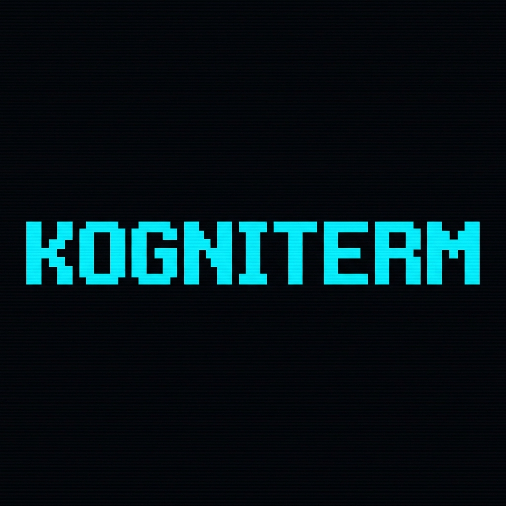

# 🤖 KogniTerm




> **KogniTerm** es un agente evolutivo de terminal de última generación. Convierte tu línea de comandos en un entorno de desarrollo colaborativo donde **agentes de IA especializados** razonan, investigan, codifican y ejecutan tareas complejas en tu nombre.
>
> A diferencia de la mayoría de asistentes, KogniTerm **no depende de las capacidades nativas de *Tool Calling* de los modelos**. Su **Motor de Parseo Universal** interpreta las intenciones de cualquier LLM (Gemini, GPT-4/5, Claude, DeepSeek, Llama 3, Mistral, Qwen…) directamente desde lenguaje natural, JSON embebido o XML, normalizando la salida para ejecutar la herramienta correcta. Eso lo vuelve compatible con modelos abiertos y proveedores locales.

[](https://www.python.org/)
[](kogniterm/__init__.py)
[](#-licencia)
[](#-instalación-rápida)

---

## ✨ Capacidades destacadas

- 🧠 **Núcleo multi-agente** con orquestador, agente de código (DeepCoder), agente investigador (DeepResearcher) y agentes dinámicos bajo demanda.
- 🌐 **Multi-proveedor LLM** vía [LiteLLM](https://github.com/BerriAI/litellm): Google, OpenAI, Anthropic, OpenRouter, Cohere, ZhipuAI, Ollama Cloud, Ollama local, KiloCode y un *provider* personalizado.
- 🛰 **Arquitectura cliente-servidor (FastAPI + WebSocket/SSE/REST)** que permite controlar la misma sesión desde la TUI local, un bot de Telegram, un webhook de Slack o un cliente HTTP propio.
- 🔌 **Sistema de skills modular** con 25+ skills *bundled* (filesystem, memoria, web, código, PC, Python, RAG, etc.), descubrimiento dinámico, versionado, *migrator* y *skill-factory* para autoextensión en caliente.
- 🧩 **Motor de parseo universal** que normaliza JSON, XML, bloques de código y Markdown para invocar herramientas aunque el modelo no soporte *tool calling*.
- 🛡 **Human-in-the-loop** con aprobación explícita, *edición atómica*, *rollback* por transacción, *race-condition guard* y *command rules* por rol.
- 🗂 **Indexado RAG semántico** (ChromaDB + fastembed/sentence-transformers) con `kogniterm index` para que los agentes "conozcan" tu repositorio.
- 🧵 **Múltiples canales** paralelos: TUI, terminal, CLI, Telegram, webhooks y adaptadores Slack listos para producción.
- 🔄 **Migración de skills** y *refreshing* en caliente sin reiniciar la sesión.

---

## 🚀 Instalación Rápida

### Opción A — Instalador oficial (recomendado)

```bash
curl -fsSL https://raw.githubusercontent.com/gatovillano/KogniTerm/main/install.sh | bash
```

> [!IMPORTANT]
> Si tu shell no es estándar (p. ej. `fish`) o ves `curl: (23) Failure writing output to destination`, descarga el script y ejecútalo en dos pasos:
> ```bash
> curl -fsSL -O https://raw.githubusercontent.com/gatovillano/KogniTerm/main/install.sh && bash install.sh && rm install.sh
> ```

El instalador se encarga de:

1. Descargar la última versión oficial desde GitHub.
2. Crear un entorno virtual aislado en `~/.kogniterm/venv`.
3. Generar el binario global `~/.local/bin/kogniterm`.
4. Asistirte en la configuración del proveedor LLM y del bot de Telegram.

> [!NOTE]
> Asegúrate de tener `~/.local/bin` en tu `$PATH`. Si no, puedes iniciar KogniTerm con:
> `source ~/.kogniterm/venv/bin/activate && kogniterm`

### Opción B — PyPI

```bash
# Aislamiento recomendado
pipx install kogniterm

# o bien
pip install kogniterm
```

### Opción C — Desde el código fuente (desarrollo)

```bash
git clone https://github.com/gatovillano/KogniTerm.git
cd KogniTerm
python -m venv .venv && source .venv/bin/activate
pip install -e .
kogniterm          # cliente TUI
kogniterm-server   # servidor FastAPI
```

Una vez instalado, ejecuta:

```bash
kogniterm
```

---

## 🎬 Primer uso

Al arrancar por primera vez, KogniTerm te guiará por un asistente interactivo para:

1. Elegir tu **proveedor LLM** (Google, OpenAI, Anthropic, OpenRouter, Cohere, ZhipuAI, Ollama, LiteLLM, KiloCode u Ollama Cloud).
2. Guardar la **API key** correspondiente (en `~/.kogniterm/.env` o vía `kogniterm keys`).
3. Configurar opcionalmente el **bot de Telegram**.
4. Seleccionar el **modelo por defecto** con `kogniterm models use …`.

Todo el estado se persiste en `~/.kogniterm/`, incluyendo historial de conversaciones, skills *workspace*, configuración, embeddings y logs.

---

## 🏗 Arquitectura

KogniTerm ha evolucionado de un monolito local a un **ecosistema modular cliente-servidor** multi-canal.

```
┌────────────────────────────────────────────────────────────────┐
│                       KogniTerm Server                         │
│                     (FastAPI · WebSocket/SSE/REST)             │
│                                                                │
│  ┌──────────────┐  ┌──────────────┐  ┌──────────────────────┐   │
│  │  SessionPool │  │  AgentPool   │  │  Channel  Adapters   │   │
│  │ (N sesiones) │  │ (delegación) │  │ TUI · CLI · Telegram │   │
│  └──────┬───────┘  └──────┬───────┘  │ Slack · Webhooks     │   │
│         └─────────────────┴──────────┴──────────┬───────────┘   │
│                                                │               │
│  ┌─────────────────────────────────────────────▼────────────┐   │
│  │             LangGraph StateGraph (orquestador)          │   │
│  │   ┌─────────────┐  ┌──────────────┐  ┌──────────────┐    │   │
│  │   │ LLMService  │  │ AgentState   │  │ HistoryMgr   │    │   │
│  │   │ (multi-prov)│  │ (race-safe)  │  │ (debounce 2s)│    │   │
│  │   └──────┬──────┘  └──────────────┘  └──────────────┘    │   │
│  │          │                                               │   │
│  │   ┌──────▼──────────────────────────────────────────┐    │   │
│  │   │  Motor de Parseo Universal → Tool Router        │    │   │
│  │   └──────┬──────────────────────────────────────────┘    │   │
│  │          ▼                                               │   │
│  │   ┌────────────────────────────────────────────────┐    │   │
│  │   │  Skill Manager + DelegationManager (RBAC)      │    │   │
│  │   └────────────────────────────────────────────────┘    │   │
│  │   ┌────────────┐  ┌────────────┐  ┌─────────────────┐    │   │
│  │   │ CommandExec│  │  ChromaDB  │  │ fastembed/      │    │   │
│  │   │ (sandbox)  │  │  +RAG ctx  │  │ sentence-transf │    │   │
│  │   └────────────┘  └────────────┘  └─────────────────┘    │   │
│  └─────────────────────────────────────────────────────────┘   │
└────────────────────────────────────────────────────────────────┘
                ▲                ▲                 ▲
                │                │                 │
        ┌───────┴──────┐  ┌──────┴───────┐ ┌───────┴─────────┐
        │   TUI (RICH) │  │  CLI / Meta  │ │ Telegram / Slack │
        │  (Textual)   │  │  commands    │ │   bot / Webhook │
        └──────────────┘  └──────────────┘ └─────────────────┘
```

### 🧠 Núcleo multi-agente

| Agente               | Rol                                                                 |
| -------------------- | ------------------------------------------------------------------- |
| `BashAgent`          | Orquestador principal y punto de interacción con el usuario.       |
| `CodeAgent` (DeepCoder)  | Ingeniero de software: edición precisa, validación, diffs, tests. |
| `ResearcherAgent` (DeepResearcher) | Analista de solo-lectura: investiga, resume y reporta.    |
| Agentes dinámicos    | Generados en caliente con `system_prompt` personalizado.            |

La **delegación** se gestiona con `DelegationManager`: controla profundidad máxima, concurrencia por padre y RBAC por rol (cada rol declara `DEFAULT_BLOCKED_TOOLS`).

### ⚙️ Motor de Parseo Universal

KogniTerm no exige que el LLM devuelva JSON con un esquema concreto. Su parser (`core/llm/`) reconoce:

- *Tool calling* nativo (Anthropic/OpenAI/Gemini).
- Bloques ```json``` o ```xml``` embebidos en prosa.
- Comandos `printf`-style (`<bash>...</bash>`).
- Markdown estructurado.

Todo se normaliza a la misma `ToolRouter`, lo que permite usar modelos abiertos (DeepSeek, Llama 3, Qwen, Mistral) con el mismo nivel de agencia que GPT-5 o Claude.

### 🛰 Arquitectura cliente-servidor

- **Servidor** (`kogniterm server`, FastAPI en `:8765`): mantiene el agente vivo entre mensajes, expone WebSocket/SSE/REST, y enruta adaptadores de canal.
- **TUI** (`kogniterm`): cliente *headless-friendly* basado en **Textual** + **Rich** que se conecta al servidor y comparte sesión con Telegram u otros canales.
- **Adaptadores** (`server/channel_adapters.py`): `CLIAdapter`, `WebhookAdapter`, `SlackAdapter` listos para producción.

Esto habilita la **Ubicuidad Agéntica**: la misma sesión corre en tu PC y en tu móvil, con persistencia total y resiliencia ante cierres.

---

## 🛡 Seguridad y robustez

| Capa                  | Implementación                                                                  |
| --------------------- | ------------------------------------------------------------------------------- |
| **Human-in-the-loop** | Confirmación explícita de comandos destructivos, diffs antes de aplicar, modo `-y`. |
| **Edición atómica**   | `advanced_file_editor` valida, transacciona y hace *rollback* en fallos.       |
| **Race conditions**   | `core/race_condition_guard.py` serializa acceso a recursos compartidos.         |
| **RBAC por agente**   | `DelegationManager` aplica `DEFAULT_BLOCKED_TOOLS` por rol (p. ej. `ResearcherAgent` no escribe). |
| **Reglas de comando** | `core/agents/config/command_rules.yaml.example` para whitelist/blacklist.       |
| **Límites de delegación** | Profundidad y concurrencia por orquestador configurables.                  |
| **Bucles infinitos**  | Detección de patrones repetitivos en BashAgent.                                 |
| **Sandbox**           | Comandos aislados, *timeouts* y captura de salida segura.                        |
| **Secretos**          | API keys fuera del repo, `mask_url_credentials`, redacción en logs.             |

---

## ⚙️ Configuración y CLI

KogniTerm expone una CLI completa para gestionar estado, llaves y modelos.

### 🔑 API keys

```bash
kogniterm keys set openrouter sk-or-v1-...
kogniterm keys set google   AIzaSy...
kogniterm keys set anthropic sk-ant-...
kogniterm keys list
```

Las llaves se almacenan en `~/.kogniterm/.env` (con `override=True` para que prevalezcan sobre el `.env` del proyecto).

### 🤖 Modelos

```bash
kogniterm models use google/gemini-2.0-flash-exp
kogniterm models current
kogniterm models list
```

También puedes hacer override temporal por invocación:

```bash
LITELLM_MODEL=openai/gpt-4o kogniterm
```

### 📱 Bot de Telegram

```bash
kogniterm config telegram        # asistente interactivo
kogniterm config telegram status
kogniterm config telegram enable
```

### 🧠 RAG / Indexado de código

```bash
kogniterm index .                 # indexa el proyecto actual
```

Genera embeddings con `fastembed`/`sentence-transformers`, los almacena en ChromaDB y permite preguntas semánticas sobre la arquitectura del repositorio.

### 🖥 Servidor centralizado

```bash
python -m kogniterm.server                # arranca en :8765
python -m kogniterm.server --host 0.0.0.0 --port 8765
python -m kogniterm.server --reload       # hot-reload en desarrollo
kogniterm-server                          # vía entry-point instalado
```

Documentación OpenAPI: `http://localhost:8765/docs`.

---

## 🎮 Comandos interactivos

### Comandos mágicos (`/`)

- `/models` — cambia el modelo en caliente.
- `/reset` — limpia el contexto y comienza de cero.
- `/undo` — deshace la última acción del agente.
- `/compress` — resume el historial para ahorrar tokens.
- `/keys` — gestiona las API keys almacenadas.
- `/skills` — lista, instala o actualiza skills.
- `/index` — indexa el proyecto para RAG.
- `/help` — ayuda contextual.

### Referencias a archivos (`@`)

Inyecta el contenido de un archivo en el contexto del mensaje:

```text
¿Qué hace la función process en @core/llm_service.py?
```

### Atajos de aprobación

- `y` — aprueba la acción pendiente.
- `n` — la rechaza.
- `e` — edita el comando antes de aprobarlo.
- `Esc` — interrumpe la generación en curso.

---

## 🔌 Skills y extensibilidad

KogniTerm trae un **framework de skills** de primera clase. Cada skill es una carpeta con `SKILL.md` + `scripts/tool.py` (función con `parameters_schema`) y se descubre dinámicamente.

### Skills *bundled* (incluidas)

| Categoría        | Skills                                                                                                |
| ---------------- | ----------------------------------------------------------------------------------------------------- |
| **Memoria**      | `memory-read`, `memory-append`, `memory-init`, `memory-summarize`, `memory-write`, `search-memory`    |
| **Archivos**     | `advanced-file-editor`, `file-operations`, `file-read-directory`, `file-update`                       |
| **Código**       | `code-tools`, `execute-command`, `python-executor`, `pc-interaction`                                   |
| **Web**          | `web-tools` (Tavily, fetch, scraping, GitHub)                                                          |
| **Agentes**      | `call-agent`, `call-agents-parallel`, `set-llm-instructions`                                           |
| **Meta**         | `skill-factory` (autoextensión), `refresh-tools`, `plan-creation`, `agent-skills-adapter`             |
| **Utilidades**   | `task-tracker`, `task-complete`, `think`                                                               |

### Crear tu propia skill

```text
mi_skill/
├── SKILL.md                 # frontmatter + instrucciones
└── scripts/
    └── tool.py              # def main(...): ... + parameters_schema
```

KogniTerm detecta skills en `bundled/`, `workspace/`, `managed/` y `external/`. Usa el meta-comando `/skills install` o instala desde `skills.sh`:

```bash
npx skills install <owner/repo@skill>
```

Más detalles en `kogniterm/skills/bundled/skill-factory/SKILL.md`.

---

## 🧵 Múltiples canales (Telegram, Slack, Webhooks)

```python
from kogniterm.server.channel_adapters import WebhookAdapter, SlackAdapter

# Webhook genérico (Slack incoming, n8n, Zapier...)
adapter = WebhookAdapter(
    webhook_url="https://hooks.slack.com/services/...",
    session_id="slack-bot",
    filter_types=["stream", "done", "error"],
)
await adapter.send_message("Analiza los logs del sistema")

# Slack Bolt
from slack_bolt.async_app import AsyncApp
slack_app = AsyncApp(token="xoxb-...")
adapter = SlackAdapter(slack_app=slack_app, channel="#ops", session_id="slack-ops")
```

Consulta `kogniterm/server/README.md` para el protocolo completo de WebSocket, SSE y REST.

---

## 🗂 Estructura del repositorio

```text
kogniterm/
├── main.py                  # shim (el entry-point real está en terminal/terminal.py)
├── terminal/                # Cliente TUI (Textual + Rich) y CLI
│   ├── terminal.py          # entry-point principal
│   ├── tui/                 # app, paneles, componentes
│   ├── cli.py               # sub-comandos (keys, models, index, config…)
│   ├── meta_command_processor.py
│   └── command_approval_handler.py
├── core/                    # Cerebro: orquestación, agentes, LLM
│   ├── llm_service.py       # motor multi-proveedor (LiteLLM)
│   ├── llm/                 # parser, streaming, rate-limiter, fallback
│   ├── llm_services/        # tipos, providers, tools, parser
│   ├── agents/              # BashAgent, CodeAgent, ResearcherAgent, DeepCoder, DeepResearcher
│   ├── delegation/          # DelegationManager + RBAC por rol
│   ├── skills/              # SkillManager, SkillMigrator
│   ├── context/             # ChromaDB, codebase indexer, project memory
│   ├── history_manager.py   # auto-guardado con debounce y tiktoken
│   └── message_manager.py
├── server/                  # Backend FastAPI (WebSocket/SSE/REST)
│   ├── app.py
│   ├── session_pool.py
│   ├── channel_adapters.py
│   └── __main__.py          # entry-point `python -m kogniterm.server`
├── skills/                  # Framework de skills
│   ├── bundled/             # 25+ skills oficiales
│   ├── workspace/           # skills generadas por el usuario
│   ├── managed/             # skills administradas
│   └── external/            # skills de terceros
├── agent-browser/           # Sub-módulo para automatización web/CDP
├── ui/                      # Temas y componentes visuales
├── utils/                   # Logger, diff renderer, playwright manager
├── docs/                    # Arquitectura, análisis de deuda, registro de errores
└── pyproject.toml           # build setuptools + entry-points
```

---

## 🧪 Desarrollo

```bash
# Tests del servidor
python kogniterm/server/test_client.py

# Lint de las skills
radon mi kogniterm/skills -s

# Indexar el propio repo para probar RAG
kogniterm index .
```

Variables de entorno útiles:

| Variable                    | Descripción                                                  |
| --------------------------- | ------------------------------------------------------------ |
| `LITELLM_MODEL`             | Override temporal del modelo por defecto.                    |
| `KOGNITERM_REASONING_EFFORT`| Esfuerzo de razonamiento (low / medium / high).              |
| `KOGNITERM_SERVER_URL`      | URL del servidor al que se conecta la TUI cliente.           |
| `GOOGLE_API_KEY`            | API key para Google Gemini.                                  |
| `OPENAI_API_KEY`            | API key para OpenAI.                                         |
| `ANTHROPIC_API_KEY`         | API key para Anthropic.                                      |
| `OPENROUTER_API_KEY`        | API key para OpenRouter.                                     |
| `OLLAMA_CLOUD_API_KEY`      | API key para Ollama Cloud.                                   |
| `CREWAI_TELEMETRY_OPT_OUT`  | Se fuerza a `true` automáticamente (sin telemetría).         |

---

## 🐛 Solución de problemas

- **`curl: (23) Failure writing output to destination`** al instalar → usa el método de dos pasos con `-O install.sh`.
- **El bot de Telegram no responde** → `kogniterm config telegram status` y revisa `~/.kogniterm/logs/`.
- **Quiero empezar de cero** → borra `~/.kogniterm/` (cuidado: perderás historial y skills *workspace*).
- **Modelo no disponible** → `kogniterm models list` y comprueba la API key con `kogniterm keys list`.

Más incidentes resueltos en `kogniterm/docs/registro_errores_soluciones.md`.

---

## 📚 Documentación técnica

- `kogniterm/docs/ARCHITECTURE_ANALYSIS.md` — análisis arquitectónico completo.
- `kogniterm/docs/ARQUITECTURA_AGENTES.md` — orquestación, RBAC y delegación.
- `kogniterm/docs/ANALISIS_DEUDA_TECNICA.md` — deuda técnica y roadmap.
- `kogniterm/docs/researcher_agent_flow.md` — flujo interno del agente investigador.
- `kogniterm/docs/Cambios.md` — *changelog* extendido.
- `kogniterm/server/README.md` — API del servidor (WebSocket/SSE/REST).
- `kogniterm/skills/bundled/*/SKILL.md` — docs de cada skill.

---

## 🤝 Contribuir

1. Haz *fork* del repositorio.
2. Crea una rama: `git checkout -b feat/mi-mejora`.
3. Añade una skill *bundled* o un agente nuevo bajo `kogniterm/`.
4. Verifica con `radon` y `python -m kogniterm.server --reload`.
5. Abre un *Pull Request* describiendo el cambio.

Las skills nuevas deben pasar por `skill-factory` para auto-generarse, o pueden añadirse manualmente bajo `kogniterm/skills/bundled/<nombre>/`.

---

## 📄 Licencia

MIT — ver [`LICENSE`](LICENSE).

---

*Desarrollado por [Gatovillano](https://github.com/gatovillano) con cariño para la comunidad.*
