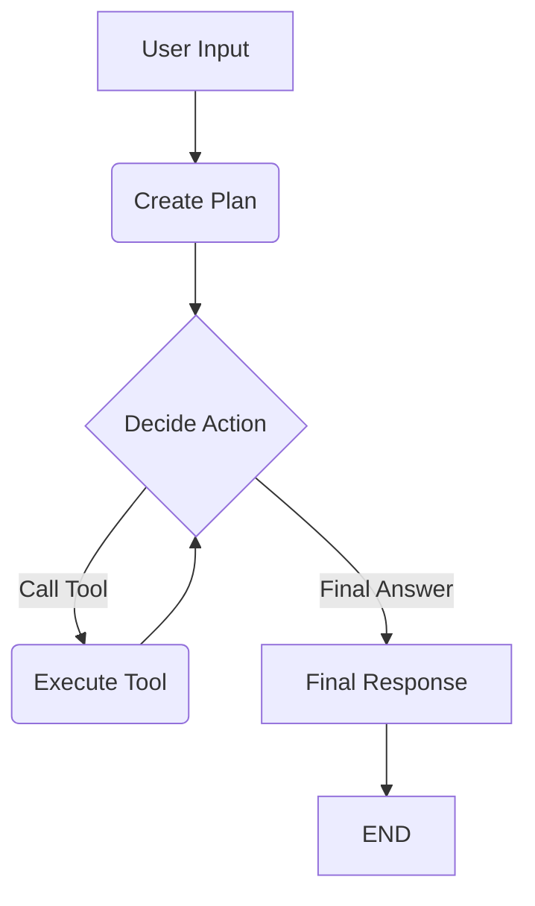

# Análisis Profundo del Código de KogniTerm y Propuesta de Refactorización

El proyecto KogniTerm presenta una estructura modular con agentes (`bash_agent`, `orchestrator_agent`), un servicio de LLM (`llm_service`), un ejecutor de comandos de terminal (`command_executor`) y un conjunto de herramientas (`tools`). La interfaz de usuario (`terminal.py`) orquesta la interacción con estos componentes.

## 1. Análisis por Componente y Oportunidades de Refactorización

### `kogniterm/core/__init__.py`
*   **Análisis**: Vacío.
*   **Refactorización**: No aplica directamente. Podría usarse para configuraciones globales de logging o inicialización si el proyecto crece.

### `kogniterm/core/agents/bash_agent.py`
*   **Análisis**: Este agente está bien estructurado para su propósito de ejecutar comandos bash con un ciclo de aprobación.
    *   `SYSTEM_MESSAGE`: Es una cadena larga hardcodeada.
    *   `AgentState.history_for_api`: La lógica para convertir mensajes a un formato compatible con la API de Google AI es algo compleja, especialmente el manejo de `tool_messages_buffer`.
    *   `explain_command_node`: La creación de `temp_history` para generar una explicación del comando es un patrón que funciona, pero es un poco indirecto.
    *   **Eficiencia**: El envío de todo el historial en cada invocación del LLM puede ser ineficiente para conversaciones muy largas.
*   **Refactorización**:
    *   **Mensajes de Sistema**: Externalizar `SYSTEM_MESSAGE` a un archivo `.md` o `.txt` separado para mejorar la limpieza del código y facilitar la edición de prompts.
    *   **`AgentState.history_for_api`**: Si la lógica de conversión se vuelve más compleja o es necesaria en otros agentes, podría extraerse a una función de utilidad compartida o a una clase base `AgentState`.
    *   **`explain_command_node`**: Aunque funcional, si se desea una explicación más integrada, se podría explorar si el LLM puede generar la explicación y la llamada a herramienta en una sola respuesta estructurada, o si la explicación se puede generar *antes* de la decisión de la herramienta. Por ahora, es una solución práctica.

### `kogniterm/core/agents/orchestrator_agent.py`
*   **Análisis**: **Este es el punto débil principal.** El orquestador actual reutiliza nodos y lógica condicional (`should_continue`) del `bash_agent` que está diseñada para un flujo de una sola acción o finalización, no para un ciclo iterativo de planificación-ejecución-observación.
    *   `create_plan_node`: Actualmente solo invoca al LLM y añade la respuesta. No hay una guía clara para que el LLM genere un plan estructurado que el agente pueda seguir.
    *   **Problema fundamental**: Después de `create_plan` y `call_model`, el `should_continue` del `bash_agent` lleva a `execute_tool` o `END`. Si ejecuta una herramienta, luego vuelve a `call_model`, y si esa llamada a `call_model` resulta en `confirm_command`, el grafo termina. Esto significa que el orquestador no tiene un bucle para:
        1.  Revisar el plan.
        2.  Ejecutar el siguiente paso del plan.
        3.  Observar el resultado.
        4.  Decidir el siguiente paso basándose en el resultado y el plan.
*   **Refactorización**: Requiere una reestructuración significativa del grafo para implementar el ciclo "Plan -> Act -> Observe -> Re-Plan/Decide". Esto se detalla en la sección "Orquestador Mejorado".

### `kogniterm/core/command_executor.py`
*   **Análisis**: Implementación robusta para la ejecución de comandos en un PTY, manejando la entrada/salida interactiva y la cancelación.
    *   `decode(errors='ignore')`: Pragmático para la salida de terminal, pero puede ocultar problemas de codificación si la fidelidad de los datos es crítica. Para un intérprete de terminal, es una elección razonable.
    *   **Eficiencia**: El uso de `select` para E/S no bloqueante es eficiente para la interactividad.
*   **Refactorización**: Generalmente bien. Podría considerarse añadir un manejo más explícito de diferentes tipos de errores de `subprocess` si fuera necesario.

### `kogniterm/core/llm_service.py`
*   **Análisis**: Servicio centralizado para interactuar con el modelo Gemini, con conversión de herramientas de LangChain a `FunctionDeclaration` de Google AI.
    *   `invoke`: Crea una nueva sesión de chat en cada invocación y envía todo el historial. Esto asegura el contexto completo pero puede ser costoso e ineficiente para conversaciones muy largas.
    *   **Eficiencia**: Para conversaciones extensas, la retransmisión completa del historial puede agotar los límites de tokens o aumentar la latencia.
*   **Refactorización**:
    *   **Manejo de Historial Largo**: Para aplicaciones de larga duración o conversaciones muy extensas, se podría implementar una estrategia de "memoria" o "resumen" para condensar el historial antes de enviarlo al LLM. Esto es una mejora avanzada.
    *   **Robustez de `last_message`**: La línea `last_message = history[-1]['parts'][0]` asume una estructura específica. Añadir verificaciones para la existencia de `parts` y su contenido podría hacerla más robusta.

### `kogniterm/core/tools.py`
*   **Análisis**: Define las herramientas disponibles para los agentes, siguiendo un buen patrón con Pydantic para la validación de argumentos.
    *   `GitHubTool._read_directory_recursive`: Para repositorios muy grandes, la lectura recursiva puede generar muchas llamadas a la API de GitHub, lo que puede ser lento y golpear los límites de tasa.
    *   **Eficiencia**: Las demás herramientas (`BraveSearch`, `WebFetch`, `WebScraping`, `ExecuteCommand`) utilizan bibliotecas estándar y son eficientes para sus tareas.
*   **Refactorización**:
    *   **`GitHubTool._read_directory_recursive`**: Si se detectan problemas de rendimiento o límites de tasa con repositorios grandes, se podría refactorizar para usar la API de datos de Git de GitHub (árboles git) para obtener la estructura completa en menos llamadas, y luego recuperar el contenido de los archivos de forma selectiva.
    *   **Validación de Entorno**: Aunque se verifica la existencia de variables de entorno, centralizar la carga y validación de todas las claves API al inicio de la aplicación podría ser más limpio.

### `kogniterm/terminal/terminal.py`
*   **Análisis**: Maneja la interfaz de usuario, la lógica de los comandos meta y la interacción con los agentes.
    *   **Reintroducción de `auto_approve`**: La nota en el código indica que `auto_approve` se reintrodujo, lo cual es una buena característica.
    *   **Lógica de `command_to_confirm`**: La interfaz de terminal maneja la confirmación y ejecución de comandos, y luego re-invoca al agente con la salida. Esta es una separación de responsabilidades efectiva entre la UI y la lógica del agente.
    *   **`print_welcome_banner`**: El código proporcionado para el banner de bienvenida no incluye la lógica de interpolación de colores.
*   **Refactorización**:
    *   **Banner de Bienvenida**: Asegurarse de que la lógica de interpolación de colores esté completa para `rich`.
    *   **Consistencia de Impresión**: Utilizar `console.print` o `print` de forma más consistente. Si `rich` está disponible, aprovecharlo al máximo.

## Refactorización General para Eficiencia y Limpieza

1.  **Configuración Centralizada**:
    *   Utiliza una biblioteca como `python-dotenv` para cargar variables de entorno desde un archivo `.env` o una clase de configuración (ej. usando `Pydantic Settings`) para gestionar todas las claves API y configuraciones del modelo de forma centralizada.
2.  **Externalización de Prompts**:
    *   Mueve todos los mensajes de sistema (y posiblemente otros prompts complejos) a archivos Markdown o de texto separados en un directorio `prompts/`. Cárgalos dinámicamente. Esto desacopla el prompt engineering del código.
3.  **Logging Unificado**:
    *   Configura el módulo `logging` al inicio de la aplicación (`terminal.py` o un archivo de configuración principal) y úsalo consistentemente en lugar de `print` para mensajes de depuración, información y errores.
4.  **Clases Base / Mixins**:
    *   Si la lógica de `history_for_api` o la inicialización de herramientas es común a múltiples `AgentState` o servicios, considera crear una clase base o un mixin.
5.  **Manejo de Errores Consistente**:
    *   Define una estrategia clara para el manejo de errores: ¿cuándo se lanza una excepción? ¿cuándo se devuelve un mensaje de error legible por el LLM? Asegura que los errores críticos (ej. falta de API key) se manejen al inicio.

## Creación de un Orquestador Mejorado y Funcional

El orquestador actual falla porque no implementa un ciclo iterativo de "Plan -> Act -> Observe -> Re-Plan/Decide". Necesitamos rediseñar su grafo para reflejar este flujo.

### Concepto del Orquestador Mejorado

El orquestador debería seguir estos pasos principales:

1.  **Entender la Petición**: Recibir la solicitud del usuario.
2.  **Crear Plan**: Generar un plan detallado paso a paso para resolver la solicitud.
3.  **Decidir Siguiente Acción**: Basándose en el plan, el progreso y los resultados anteriores, decidir cuál es la próxima acción:
    *   Llamar a una herramienta (ejecutar un comando, buscar en la web, etc.).
    *   Si la tarea está completa, formular la respuesta final.
    *   Si un paso del plan falla, decidir cómo recuperarse o ajustar el plan.
4.  **Ejecutar Acción**: Invocar la herramienta seleccionada.
5.  **Observar Resultado**: Procesar la salida de la herramienta.
6.  **Iterar**: Volver a "Decidir Siguiente Acción" hasta que la tarea esté resuelta.
7.  **Responder**: Proporcionar la respuesta final al usuario.

### Estructura del Grafo Propuesto (`orchestrator_graph`)



### Detalle de los Nodos y Transiciones del Orquestador Mejorado

Vamos a modificar `kogniterm/core/agents/orchestrator_agent.py`.

#### 1. `OrchestratorAgentState` (Estado del Agente)

Necesitamos un estado que no solo contenga los mensajes, sino también el plan y quizás un índice para seguir el paso actual.

```python
# kogniterm/core/agents/orchestrator_agent.py

from langgraph.graph import StateGraph, END
from dataclasses import dataclass, field
from typing import List, Optional

from langchain_core.messages import BaseMessage, HumanMessage, AIMessage, ToolMessage, SystemMessage
import google.generativeai as genai

from ..llm_service import LLMService
# Reutilizamos los nodos de ejecución de herramientas de bash_agent, que ya son robustos.
from .bash_agent import execute_tool_node # OJO: execute_tool_node en bash_agent ya maneja la lógica de `command_to_confirm` para el terminal.

llm_service = LLMService()

# --- Mensaje de Sistema para el Orquestador (Externalizar si es posible) ---
SYSTEM_MESSAGE_ORCHESTRATOR = SystemMessage(content=\"\"\"Eres un agente orquestador experto.
Tu objetivo es desglosar problemas complejos en una secuencia de pasos ejecutables y llevarlos a cabo usando tus herramientas.
Antes de cualquier acción, crea un plan detallado paso a paso para abordar la solicitud del usuario.

1.  **Analiza la Petición**: Comprende la solicitud completa del usuario.
2.  **Crea un Plan**: Genera un plan de acción detallado y paso a paso para resolver la solicitud.
3.  **Piensa Paso a Paso**: Decide cuál es la primera acción que debes tomar basándote en el plan. No intentes resolver todo de una vez.
4.  **Ejecuta una Acción**: Usa una de tus herramientas para realizar el primer paso. La herramienta más común que usarás es `execute_command` para correr comandos de terminal.
5.  **Observa el Resultado**: Después de cada ejecución de herramienta, recibirás el resultado. Analízalo.
6.  **Decide el Siguiente Paso**: Basado en el resultado y el plan, decide si la tarea está completa o cuál es la siguiente acción a tomar.
7.  **Repite**: Continúa este ciclo de acción y observación hasta que la solicitud del usuario esté completamente resuelta.
8.  **Responde al Usuario**: Solo cuando la tarea esté 100% completada, proporciona una respuesta final y amigable al usuario.

Cuando recibas la salida de una herramienta, analízala, resúmela y preséntala al usuario de forma clara y amigable, utilizando formato Markdown si es apropiado.
\"\"\")

@dataclass
class OrchestratorAgentState:
    \"\"\"Define la estructura del estado que fluye a través del grafo del orquestador.\"\"\"
    messages: List[BaseMessage] = field(default_factory=lambda: [SYSTEM_MESSAGE_ORCHESTRATOR])
    plan: List[str] = field(default_factory=list) # Para almacenar los pasos del plan
    command_to_confirm: Optional[str] = None # Todavía necesario para la interacción con el terminal

    @property
    def history_for_api(self) -> list[dict]:
        \"\"\"Convierte los mensajes de LangChain al formato que espera la API de Google AI.\"\"\"
        # Se puede reutilizar la lógica de bash_agent o hacerla una utilidad compartida
        api_history = []
        messages = self.messages
        i = 0
        while i < len(messages):
            msg = messages[i]
            if isinstance(msg, ToolMessage):
                tool_messages_buffer = []
                while i < len(messages) and isinstance(messages[i], ToolMessage):
                    tool_messages_buffer.append(messages[i])
                    i += 1
                
                parts = [
                    genai.protos.Part(function_response=genai.protos.FunctionResponse(
                        name=tm.tool_call_id,
                        response={\'content\': tm.content}\
                    )) for tm in tool_messages_buffer
                ]
                api_history.append({\'role\': \'user\', \'parts\': parts})
                continue

            if isinstance(msg, (HumanMessage, SystemMessage)):
                api_history.append({\'role\': \'user\', \'parts\': [genai.protos.Part(text=msg.content)]})
            elif isinstance(msg, AIMessage):
                if msg.tool_calls:
                    parts = [
                        genai.protos.Part(function_call=genai.protos.FunctionCall(name=tc[\'name\'], args=tc[\'args\']))
                        for tc in msg.tool_calls
                    ]
                    api_history.append({\'role\': \'model\', \'parts\': parts})
                else:
                    api_history.append({\'role\': \'model\', \'parts\': [genai.protos.Part(text=msg.content)]})
            i += 1
        return api_history
```

#### 2. Nodos del Grafo

*   **`create_plan_node(state: OrchestratorAgentState)`**:
    *   **Propósito**: Generar un plan inicial basado en la solicitud del usuario.
    *   **Lógica**: Se invoca al LLM con la solicitud inicial del usuario y el mensaje de sistema del orquestador. Se le pide que genere un plan detallado. El plan se parsea y se almacena en `state.plan`.
    *   **Implementación**:
        ```python
        def create_plan_node(state: OrchestratorAgentState):
            \"\"\"Genera un plan de acción detallado utilizando el LLM.\"\"\"
            # El primer mensaje del historial es el SystemMessage, el segundo es el HumanMessage (petición del usuario)
            # Queremos que el LLM cree un plan basado en la petición del usuario.
            
            # Construir un historial temporal para la planificación
            planning_history = [
                {\'role\': \'user\', \'parts\': [genai.protos.Part(text=state.messages[0].content)]}, # System message
                {\'role\': \'user\', \'parts\': [genai.protos.Part(text=state.messages[1].content)]}  # User\'s initial request
            ]
            planning_prompt = "Basándote en la solicitud del usuario, crea un plan de acción detallado paso a paso. Presenta el plan como una lista numerada."
            planning_history.append({\'role\': \'user\', \'parts\': [genai.protos.Part(text=planning_prompt)]})

            response = llm_service.invoke(history=planning_history)
            
            plan_text = ""
            if response.candidates and response.candidates[0].content.parts:
                for part in response.candidates[0].content.parts:
                    if part.text:
                        plan_text += part.text
            
            # Parsear el texto del plan en una lista de pasos. Simple split por ahora.
            state.plan = [step.strip() for step in plan_text.split(\'\\n\') if step.strip() and step.strip().startswith((\'1.\', \'2.\', \'3.\', \'-\', \'*'))]
            
            # Añadir el plan como un AIMessage al historial para que el LLM lo tenga en cuenta en futuras interacciones
            state.messages.append(AIMessage(content=f"Plan generado:\\n{plan_text}"))
            
            return state
        ```

*   **`decide_action_node(state: OrchestratorAgentState)`**:
    *   **Propósito**: El "cerebro" del orquestador. Decide la próxima acción (llamar a una herramienta o dar una respuesta final) basándose en el plan, el historial y los resultados anteriores.
    *   **Lógica**: Se le pregunta al LLM: "Dado el plan y los resultados hasta ahora, ¿cuál es el siguiente paso? ¿Una herramienta o la respuesta final?". El LLM debe responder con una llamada a herramienta o un texto final.
    *   **Implementación**:
        ```python
        def decide_action_node(state: OrchestratorAgentState):
            \"\"\"Decide la próxima acción (herramienta o respuesta final) basándose en el plan y el progreso.\"\"\"
            plan_str = "\\n".join([f"{i+1}. {step}" for i, step in enumerate(state.plan)])
            
            # Construir un prompt que incluya el plan y pida la siguiente acción.
            # Incluir el historial completo para que el LLM tenga contexto
            
            decision_prompt = f\"\"\"Dado el siguiente plan de acción:
{plan_str}

Y el historial de conversación actual (incluyendo resultados de herramientas):
<historial_completo>

¿Cuál es la **siguiente acción** que debo tomar para avanzar en el plan?
Puedes:
1.  Llamar a una herramienta (ej. `execute_command`, `brave_search`, `github_tool`).
2.  Si la tarea está completamente resuelta y has verificado los resultados, proporciona la **respuesta final** al usuario.
\"\"\"
            # El LLM ya tiene el historial en el estado, solo necesitamos añadir el prompt de decisión.
            temp_messages = list(state.messages) # Copiar para no modificar el estado original antes de la invocación
            temp_messages.append(HumanMessage(content=decision_prompt))

            # Convertir a formato de API para la invocación
            temp_history_for_api = OrchestratorAgentState(messages=temp_messages).history_for_api
            response = llm_service.invoke(history=temp_history_for_api)

            # Procesar la respuesta del LLM (llamada a herramienta o texto final)
            if response.candidates and response.candidates[0].content.parts:
                tool_calls = []
                text_response_parts = []
                for part in response.candidates[0].content.parts:
                    if part.function_call.name:
                        tool_name = part.function_call.name
                        tool_args = {key: value for key, value in part.function_call.args.items()}
                        tool_calls.append({"name": tool_name, "args": tool_args, "id": tool_name})
                    elif part.text:
                        text_response_parts.append(part.text)
                
                if tool_calls:
                    ai_message = AIMessage(content="", tool_calls=tool_calls)
                    state.messages.append(ai_message)
                elif text_response_parts:
                    text_response = "".join(text_response_parts)
                    state.messages.append(AIMessage(content=text_response))
            else:
                error_message = "El modelo no proporcionó una respuesta válida para la decisión de acción."
                if response.prompt_feedback and response.prompt_feedback.block_reason:
                    error_message += f" Razón de bloqueo: {response.prompt_feedback.block_reason.name}"
                state.messages.append(AIMessage(content=error_message))
                
            return state
        ```
        *   **Nota**: El `<historial_completo>` en el prompt se refiere a que el LLM ya tiene acceso a `state.messages` a través de `history_for_api`. La clave es que el prompt dirija al LLM a tomar una decisión sobre la `siguiente acción`.

*   **`execute_tool_node(state: OrchestratorAgentState)`**:
    *   **Propósito**: Ejecutar la herramienta que el LLM ha decidido usar.
    *   **Lógica**: **Reutilizamos directamente el `execute_tool_node` del `bash_agent`**. Este nodo ya sabe cómo invocar las herramientas y, crucialmente, si la herramienta es `execute_command`, prepara `state.command_to_confirm` para que la interfaz de `terminal.py` lo maneje.
    *   **Implementación**: `execute_tool_node` ya está definido en `bash_agent.py`. Simplemente lo importamos.

*   **`final_response_node(state: OrchestratorAgentState)`**:
    *   **Propósito**: Generar la respuesta final al usuario una vez que la tarea ha sido completada.
    *   **Lógica**: Podría simplemente pasar el último `AIMessage` si el `decide_action_node` ya generó la respuesta final. O, si se desea una síntesis final, se podría invocar al LLM una última vez.
    *   **Implementación**:
        ```python
        def final_response_node(state: OrchestratorAgentState):
            \"\"\"Genera la respuesta final al usuario.\"\"\"
            # El último AIMessage del decide_action_node debería contener la respuesta final.
            # Podríamos añadir un paso aquí para que el LLM refine la respuesta si es necesario.
            # Por ahora, simplemente pasa el estado.
            return state
        ```

#### 3. Lógica Condicional (`should_orchestrator_continue`)

Esta función determina la transición entre nodos.

```python
# kogniterm/core/agents/orchestrator_agent.py

def should_orchestrator_continue(state: OrchestratorAgentState) -> str:
    \"\"\"Decide si el orquestador debe ejecutar una herramienta o dar una respuesta final.\"\"\"
    last_message = state.messages[-1]
    
    # Si el LLM decidió llamar a una herramienta
    if isinstance(last_message, AIMessage) and last_message.tool_calls:
        # Si es un execute_command, el terminal.py lo gestionará y re-invocará al agente.
        # El nodo execute_tool_node se encarga de crear el command_to_confirm.
        # Desde la perspectiva del grafo, después de decidir una tool_call, vamos a ejecutarla.
        return "execute_tool"
    
    # Si el LLM proporcionó una respuesta de texto sin llamadas a herramientas, es la respuesta final
    elif isinstance(last_message, AIMessage) and not last_message.tool_calls:
        return "final_response"
    
    # Si por alguna razón no hay una decisión clara (no debería pasar si el prompt es bueno)
    # Volvemos a decidir_action para que el LLM reevalúe.
    return "decide_action"
```

#### 4. Construcción del Grafo (`orchestrator_graph`)

```python
# kogniterm/core/agents/orchestrator_agent.py

orchestrator_graph = StateGraph(OrchestratorAgentState)

orchestrator_graph.add_node("create_plan", create_plan_node)
orchestrator_graph.add_node("decide_action", decide_action_node)
orchestrator_graph.add_node("execute_tool", execute_tool_node) # Reutilizado de bash_agent
orchestrator_graph.add_node("final_response", final_response_node)

orchestrator_graph.set_entry_point("create_plan")

# Después de crear el plan, siempre vamos a decidir la primera acción.
orchestrator_graph.add_edge("create_plan", "decide_action")

# Desde "decide_action", la lógica condicional nos lleva a ejecutar una herramienta,
# dar una respuesta final, o volver a decidir si no hay una acción clara.
orchestrator_graph.add_conditional_edges(
    "decide_action",
    should_orchestrator_continue,
    {
        "execute_tool": "execute_tool",
        "final_response": "final_response",
        "decide_action": "decide_action" # Loop de seguridad si el LLM no decide claramente
    }
)

# Después de ejecutar una herramienta, siempre volvemos a decidir la siguiente acción.
# Esto es CRUCIAL para el ciclo iterativo.
orchestrator_graph.add_edge("execute_tool", "decide_action")

# Una vez que se genera la respuesta final, el grafo termina.
orchestrator_graph.add_edge("final_response", END)

orchestrator_app = orchestrator_graph.compile()
```

### Reciclaje de Elementos de `bash_agent`

Como se mencionó, el `execute_tool_node` del `bash_agent` es perfectamente reutilizable. Este nodo ya encapsula la lógica para:
*   Extraer la llamada a herramienta del `AIMessage`.
*   Invocar la herramienta correcta (incluyendo `execute_command`).
*   Manejar la preparación de `state.command_to_confirm` para que `terminal.py` tome el control de la aprobación y ejecución de comandos bash.
*   Añadir el `ToolMessage` con el resultado al estado.

Esto es muy eficiente y evita duplicación de código.

### Interacción con `terminal.py`

Es fundamental entender cómo el `terminal.py` interactúa con este nuevo orquestador:

1.  El usuario introduce un comando.
2.  `terminal.py` añade el `HumanMessage` y llama a `orchestrator_app.invoke(agent_state)`.
3.  El grafo del orquestador ejecuta `create_plan` y `decide_action`.
4.  Si `decide_action` resulta en una llamada a `execute_command`, el `execute_tool_node` establece `state.command_to_confirm`.
5.  El `orchestrator_app.invoke` finaliza, devolviendo el `state` actualizado.
6.  `terminal.py` detecta que `state.command_to_confirm` no es `None`.
7.  `terminal.py` solicita la aprobación del usuario (si `auto_approve` es falso).
8.  `terminal.py` ejecuta el comando usando `command_executor`.
9.  `terminal.py` toma la salida del comando y la añade como un `ToolMessage` a `agent_state.messages`.
10. `terminal.py` **vuelve a invocar** a `orchestrator_app.invoke(agent_state)`.
11. Esta vez, el `orchestrator_app` comenzará desde `decide_action` (ya que el `create_plan` ya se hizo), verá el nuevo `ToolMessage` con la salida del comando, y el LLM decidirá la siguiente acción basándose en esa observación.

Este flujo asegura que el orquestador pueda reaccionar a la salida de los comandos ejecutados en el terminal, permitiendo un ciclo continuo de planificación y ejecución.
