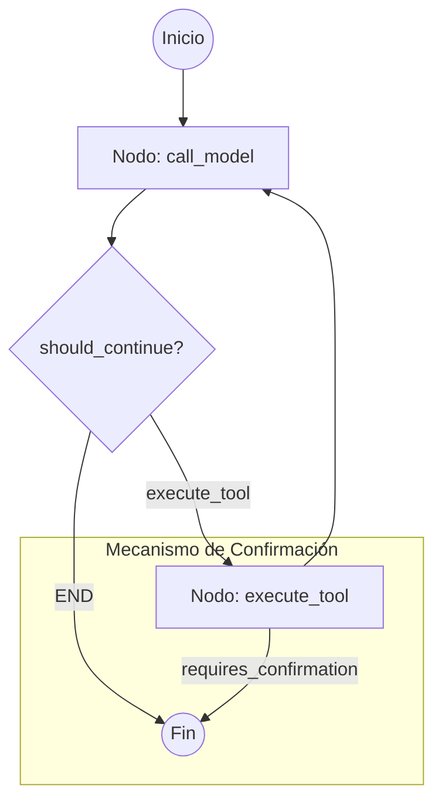

# Análisis Técnico de la Arquitectura de KogniTerm 🕵️‍♂️

## Introducción
Este documento presenta un análisis técnico detallado de la arquitectura interna de KogniTerm. A través de una exploración exhaustiva de su código fuente, se describen los componentes fundamentales que permiten la orquestación de agentes, la ejecución segura de herramientas y los mecanismos de persistencia y recuperación de información (RAG) que definen el funcionamiento del sistema.

---

## 1. Grafo de Estados de LangGraph (Orquestación de Agentes) 🧬

KogniTerm utiliza un modelo de grafo de estados definido mediante `langgraph.graph.StateGraph`. La orquestación principal se encuentra en `kogniterm/core/agents/bash_agent.py`.

### Estructura del Grafo

El flujo de trabajo es un bucle interactivo diseñado para manejar la generación de texto y la ejecución de herramientas de forma cíclica:

*   **call_model**: Envía el historial al LLM (vía `LLMService.invoke`). Soporta streaming en tiempo real y detecta si el modelo solicita herramientas (`tool_calls`).
*   **execute_tool**: Ejecuta las herramientas en paralelo usando un `ThreadPoolExecutor`. Si una herramienta devuelve un estado `requires_confirmation`, el grafo se detiene inmediatamente.
*   **should_continue**: Lógica condicional que decide si volver al modelo (tras recibir el output de una herramienta) o terminar el turno (si hay texto final o se requiere confirmación del usuario).

---

## 2. Estructura Exacta de las Herramientas (API Interna) 🛠️

Las herramientas están construidas sobre `langchain_core.tools.BaseTool` y utilizan `pydantic` para la validación de esquemas.

### execute_command

*   **Archivo**: `kogniterm/core/tools/execute_command_tool.py`
*   **Entrada (ExecuteCommandInput)**:
    *   `command` (string): El comando bash exacto a ejecutar.
*   **Salida**: Un generador que cede (`yield`) la salida estándar (stdout/stderr) en tiempo real.
*   **Seguridad**: No se ejecuta directamente en el nodo; el grafo detecta la llamada y delega la ejecución al `CommandApprovalHandler` para solicitar permiso al usuario.

### advanced_file_editor

*   **Archivo**: `kogniterm/core/tools/advanced_file_editor_tool.py`
*   **Entrada (AdvancedFileEditorInput)**:
    *   `path` (string): Ruta del archivo.
    *   `action` (string): `insert_line`, `replace_regex`, `prepend_content`, `append_content`.
    *   `content / replacement_content` (string): El texto a insertar o el reemplazo.
    *   `regex_pattern` (string, opcional): Para la acción `replace_regex`.
    *   `line_number` (int, opcional): Para `insert_line`.
    *   `confirm` (bool, default `False`): Flag crítico para la re-ejecución tras aprobación.
*   **Salida**: Un diccionario con `status: "requires_confirmation"`, un `diff` unificado y los `args` necesarios para re-ejecutar la acción.

### codebase_search_tool (RAG)

*   **Archivo**: `kogniterm/core/tools/codebase_search_tool.py`
*   **Entrada (CodebaseSearchToolArgs)**:
    *   `query` (string): Consulta semántica.
    *   `k` (int, default 5): Número de fragmentos a recuperar.
    *   `file_path_filter` (string, opcional): Filtro de ruta.
    *   `language_filter` (string, opcional): Filtro por lenguaje (ej. 'python').
*   **Salida**: Un string formateado con los fragmentos de código más relevantes, incluyendo metadatos (archivo, líneas, lenguaje).

---

## 3. Persistencia de Memoria y RAG (ChromaDB) 🧠

KogniTerm implementa un sistema de memoria de dos capas:

### Memoria Contextual (llm_context.md)

*   **Ubicación**: `.kogniterm/llm_context.md` (dentro del proyecto actual).
*   **Funcionamiento**: Las herramientas `memory_append` y `memory_read` permiten al agente persistir hechos, decisiones o estructuras del proyecto que el LLM debe recordar entre sesiones. Es una memoria de "largo plazo" basada en texto plano.

### Integración RAG con ChromaDB

*   **Motor**: `chromadb.PersistentClient` ubicado en `.kogniterm/vector_db/`.
*   **Indexación**: `VectorDBManager` gestiona la colección `codebase_chunks`. El código se divide en fragmentos (`chunks`) con metadatos (líneas, archivo, tipo de bloque).
*   **Embeddings**: Utiliza `EmbeddingsService` para convertir texto en vectores.
*   **Flujo de Búsqueda**:
    1. El usuario pregunta algo técnico.
    2. `codebase_search_tool` genera un embedding de la consulta.
    3. `ChromaDB` realiza una búsqueda por similitud de coseno (o distancia L2).
    4. Los resultados se inyectan en el prompt del agente como contexto.

---

## 4. Protocolos de Seguridad y Confirmación 🛡️

La seguridad es un pilar central de KogniTerm, implementada mediante un sistema de "Interrupción y Re-entrada".

### Flujo de Confirmación

1.  **Detección**: Cuando una herramienta (como `execute_command` o `advanced_file_editor`) se invoca, el sistema detecta que es una operación "sensible".
2.  **Estado de Suspensión**: El nodo de ejecución lanza una excepción `UserConfirmationRequired` o devuelve un estado `requires_confirmation`.
3.  **Intervención de la Terminal**: El `CommandApprovalHandler` (en `kogniterm/terminal/command_approval_handler.py`) captura este estado, genera una explicación del comando usando el LLM y presenta un panel visual al usuario.
4.  **Aprobación/Denegación**:
    *   Si el usuario dice 's': Se re-invoca la herramienta con el parámetro `confirm=True`.
    *   Si el usuario dice 'n': Se añade un `AIMessage` al historial indicando que la acción fue denegada, permitiendo al agente razonar sobre el rechazo.

---

## 5. Lógica de Delegación entre Agentes 🤝

KogniTerm utiliza un modelo de Delegación Jerárquica mediante la herramienta `call_agent`.

### BashAgent -> ResearcherAgent

1.  **Invocación**: El `BashAgent` (agente principal) decide que una tarea requiere una investigación profunda que no implica necesariamente ejecutar comandos bash (ej. "Entiende cómo funciona la autenticación en este proyecto").
2.  **Herramienta call_agent**: Se llama a esta herramienta con `agent_name="researcher_agent"` y la `task` específica.
3.  **Aislamiento de Grafo**: `call_agent` crea una instancia fresca del `ResearcherAgent` con su propio grafo y su propio `SYSTEM_MESSAGE` (el de "Detective de Código").
4.  **Transferencia de Contexto**: Se le pasa la tarea como un `HumanMessage` inicial. El `ResearcherAgent` ejecuta su propio bucle de investigación (usando RAG y lectura de archivos).
5.  **Síntesis y Retorno**: Al terminar, el `ResearcherAgent` devuelve un resumen de sus hallazgos. Este resumen se entrega al `BashAgent` como el output de la herramienta `call_agent`, permitiendo al agente principal continuar con la ejecución basada en la investigación.

---

### Observaciones de Arquitectura ("Code Smells" e Inconsistencias)

*   **Duplicidad de Streaming**: Se observó que tanto el nodo del grafo como el `LLMService` manejan lógica de streaming, lo que requiere un filtrado cuidadoso de `AIMessage` para no duplicar contenido en el historial.
*   **Sincronización de Historial**: El historial se guarda en disco (`history.json`) de forma agresiva en cada nodo para evitar pérdida de datos ante interrupciones, lo cual es robusto pero puede impactar el rendimiento en proyectos con historiales masivos.

---
**Informe realizado por el ResearchAgent de KogniTerm. 🕵️‍♂️📑**
