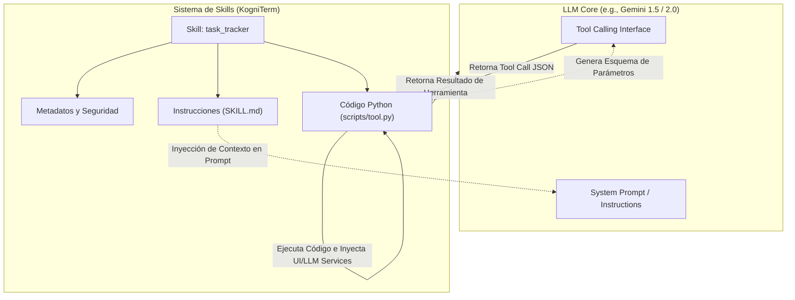

# Investigación de Arquitectura: Skills vs. Tool Calling en LLMs y su Implementación en KogniTerm

Este documento detalla la investigación técnica sobre la arquitectura de **Skills (Habilidades)** en modelos de lenguaje (LLMs), su diferenciación fundamental con **Tool Calling (Llamada a Herramientas)**, cómo se estructuran y ejecutan a nivel técnico, y cómo está diseñado y puede potenciarse este sistema dentro del proyecto **KogniTerm**.

---

## 1. Conceptos Fundamentales

### ¿Qué es Tool Calling (Llamada a Herramientas)?
**Tool Calling** es una capacidad nativa del modelo a nivel de API (provista por proveedores como Google Gemini, OpenAI o Anthropic). Permite al LLM recibir descripciones estructuradas de funciones (en esquemas JSON, típicamente siguiendo la especificación de JSON Schema) y decidir cuándo llamarlas, devolviendo un objeto JSON con el nombre de la función y los argumentos necesarios, en lugar de texto plano.

> [!NOTE]
> Tool Calling es **estático y sin estado** desde la perspectiva del LLM. El modelo no ejecuta el código; simplemente actúa como un formateador estructurado que genera la llamada de función según el contexto de la conversación.

### ¿Qué es un Skill (Habilidad)?
Un **Skill** es una abstracción de nivel superior que envuelve y organiza capacidades complejas. A diferencia de una herramienta cruda, un Skill encapsula:
1. **Instrucciones cognitivas (Prompts)**: Directrices y reglas en lenguaje natural sobre *cómo*, *cuándo* y *por qué* usar las capacidades.
2. **Uno o más Tools (Código ejecutable)**: Las funciones de código que realizan el trabajo pesado.
3. **Restricciones de seguridad y permisos**: Niveles de aislamiento (sandboxing) y flujos de aprobación del usuario.
4. **Ciclo de vida**: Descubrimiento, inicialización, carga bajo demanda (JIT), y gestión de dependencias externas.

---

## 2. Comparativa Directa: Tool Calling vs. Skills

La siguiente tabla resume las diferencias clave entre ambos paradigmas:

| Característica | Tool Calling | Skill (Arquitectura de Habilidades) |
| :--- | :--- | :--- |
| **Nivel de Abstracción** | Bajo (Nivel de API/Protocolo de Red) | Alto (Nivel de Aplicación/Arquitectura de Agentes) |
| **Componentes** | Solo el esquema de parámetros (JSON) | Metadatos (YAML) + Instrucciones (Markdown) + Código (Python) |
| **Cognición/Control** | Delegado completamente al prompt de sistema global | Control localizado mediante directrices y reglas específicas del Skill |
| **Gestión de Estado** | Inexistente (Estateless) | Puede mantener estado local u observar el estado global del agente |
| **Seguridad** | Ninguna (El modelo propone, el backend decide si confía) | Granular (Nivel de seguridad, aprobación automática, sandbox) |
| **Ciclo de Vida** | Registradas estáticamente al arrancar el modelo | Dinámicas (Carga JIT, descarga, recarga en caliente) |

### Representación del Flujo de Ejecución

El siguiente diagrama visualiza cómo interactúan ambos conceptos dentro de un sistema como KogniTerm:

---

## 3. Implementación Técnica General de Skills

En la industria, los frameworks implementan esta arquitectura siguiendo pasos clave:

1. **Descubrimiento Dinámico (Discovery)**:
   El sistema escanea rutas locales o remotas buscando convenciones de archivos (por ejemplo, archivos `manifest.json` o `SKILL.md`).
2. **Generación de Esquema por Introspección (Reflection)**:
   En lugar de escribir esquemas JSON manualmente, el backend analiza la firma de las funciones Python en tiempo de ejecución (mediante `inspect` y `get_type_hints`) para convertirlas automáticamente al estándar JSON Schema compatible con la API del LLM.
3. **Inyección de Dependencias (Dependency Injection)**:
   Cuando el código del Skill se ejecuta, requiere acceso al entorno global (UI del sistema, cliente del LLM, base de datos vectorial). El cargador inyecta estas instancias en tiempo de ejecución mediante introspección de argumentos.
4. **Aislamiento y Seguridad (Sandboxing)**:
   Skills potencialmente peligrosos se ejecutan dentro de subprocesos limitados o contenedores ligeros (como Docker o WASM) para evitar la alteración del sistema anfitrión.

---

## 4. Análisis Detallado en KogniTerm

KogniTerm cuenta con una arquitectura de Skills sumamente refinada y robusta, dividida en tres componentes principales dentro de `kogniterm/core/skills/`:

### 4.1. Estructura de un Skill
Cada skill se ubica en un subdirectorio propio y contiene:
- **`SKILL.md`**: Un archivo híbrido con frontmatter YAML para metadatos (nombre, nivel de seguridad, dependencias) y cuerpo Markdown que especifica las reglas de uso del skill para el LLM.
- **`scripts/tool.py`**: El código ejecutable en Python. Admite esquemas explícitos (`tool_schema`) o la inferencia de tipos a partir de type hints estándar de Python.

### 4.2. Flujo de Carga y Gestión
El motor se orquesta mediante los siguientes componentes:

*   **`SkillValidator`**: Valida que existan los campos obligatorios, que los niveles de seguridad sean válidos (`low`, `standard`, `medium`, `high`, `elevated`), y normaliza la nomenclatura de guiones a guiones bajos (`allowed-tools` -> `allowed_tools`).
*   **`SkillLoader`**: Importa dinámicamente los módulos Python mediante la manipulación de `sys.modules` y `importlib.util`. Implementa una solución elegante para resolver importaciones relativas creando paquetes namespace dinámicos bajo el prefijo `kogniterm_dynamic_skills`.
*   **`SkillManager`**: El núcleo de la funcionalidad. Coordina el descubrimiento en múltiples niveles de prioridad:
    1.  `bundled/` (incorporado en el proyecto)
    2.  `managed/` (configuraciones globales del usuario en `~/.kogniterm`)
    3.  `workspace/` (del proyecto local actual)
    4.  `external/` (integraciones externas)

### 4.3. Inyección y Orquestación en el Agente
Al inicializarse, `SkillManager` inyecta las instancias de servicios globales (`_llm_service` y `_terminal_ui`) directamente en las variables globales del módulo importado o en los atributos del callable de la herramienta.
Las instrucciones cognitivas de `SKILL.md` se consolidan mediante `build_skill_context_message(query)` y se inyectan dinámicamente como un `SystemMessage` complementario al prompt del agente.

---

## 5. Implementación y Estado de Evolución de la Arquitectura

Las propuestas de evolución clave han sido completamente implementadas en el núcleo de KogniTerm, logrando un balance óptimo entre flexibilidad, seguridad y persistencia:

### A. Enrutamiento Semántico (Semantic Routing/JIT Prompt Loading) - [IMPLEMENTADO]
*   **Detalle**: La clase `SkillManager` ahora extrae de forma selectiva las instrucciones cognitivas de las skills a través de su método `build_skill_context_message(query)`.
*   **Funcionamiento**: Durante la invocación (`LLMService.invoke`), el motor extrae dinámicamente la última consulta del usuario del historial de conversación y calcula la relevancia de cada habilidad. Solo se inyectan las directrices de `SKILL.md` de las skills relevantes en el prompt de sistema del LLM. Esto previene el bloat de tokens y maximiza la atención del modelo en la tarea actual.

### B. Aislamiento de Ejecución (Subprocess & bubblewrap Sandboxing) - [IMPLEMENTADO]
*   **Detalle**: Implementación de un sandbox dinámico mediante el método `_wrap_in_sandbox` en `SkillManager`.
*   **Funcionamiento**:
    1.  **Origen de confianza**: Las skills del núcleo (como `execute_command`, `file_operations`, `task_tracker`) se ejecutan directamente en la máquina host con acceso local completo para no interrumpir el flujo de desarrollo local (git, compilación, edición).
    2.  **Sandbox bubblewrap (`bwrap`)**: Para skills marcadas como `sandbox_required` o con niveles de seguridad altos (`high`/`elevated`), si bubblewrap está disponible en Linux, se monta un entorno de ejecución seguro con solo permisos de lectura para `/usr`, `/lib`, `/bin` y de escritura limitados estrictamente al directorio del espacio de trabajo actual (`Cwd`), aislando el sistema de archivos del usuario y las credenciales globales.
    3.  **Límites de Recursos**: Se aplican restricciones en el consumo de memoria RAM (límite de 512MB) y descriptores de archivos abiertos (límite de 64 descriptores) mediante el módulo `resource` de Python.

### C. Persistencia de Estado de Skill (Skill Local State / Session Cache) - [IMPLEMENTADO]
*   **Detalle**: Inyección de helpers para la persistencia transparente de estado directamente en los módulos de las skills.
*   **Funcionamiento**: Al cargar una habilidad, `SkillManager` inyecta dinámicamente en el espacio de nombres de la herramienta las funciones `get_skill_state()` y `save_skill_state(state)`. Estas persisten de manera transparente el estado local en formato JSON dentro de `.kogniterm/state/{skill_name}.json`. La habilidad `task_tracker` ha sido migrada para persistir y recuperar automáticamente el plan de trabajo de los agentes entre sesiones de KogniTerm.

### D. Resolución de Dependencias en Caliente (Hot-pip Install) - [IMPLEMENTADO]
*   **Detalle**: Resolución automática y transparente de librerías de Python.
*   **Funcionamiento**: El método `_validate_dependencies` de `SkillManager` analiza las dependencias especificadas en los metadatos YAML de `SKILL.md`. Si un paquete no está presente en el entorno virtual local, se realiza una instalación desatendida y automática mediante `pip install` antes de habilitar la habilidad, eliminando la fricción de configuración manual por parte del usuario.

---

> [!TIP]
> **Conclusión General**:
> El sistema de skills de KogniTerm no es simplemente una capa de herramientas; es un **sistema operativo cognitivo** para agentes. Separar las especificaciones técnicas del código de las instrucciones contextuales (mediante `SKILL.md`) permite a KogniTerm escalar sin comprometer el orden del código de la aplicación, manteniendo un balance óptimo entre la seguridad de ejecución y la potencia del acceso a la máquina local.

