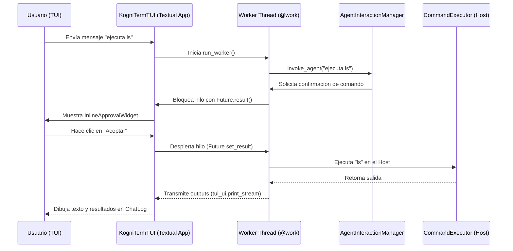

# Plan de Refactorización: Migración a Arquitectura Cliente-Servidor en KogniTerm

Este documento detalla el plan de refactorización estratégico paso a paso para migrar **KogniTerm** de un modelo de cliente autónomo monolítico a una arquitectura desacoplada de tipo **Cliente-Servidor (Backend API + Frontends Multi-Canal)**.

Esta migración mantendrá el motor de agentes (LangGraph, LLMService y ejecutor de herramientas) en un backend centralizado siempre activo, permitiendo que la interfaz **TUI (Textual)** y el bot de **Telegram** actúen como frontends puros que consumen flujos en tiempo real mediante WebSockets y REST.

---

## 1. Auditoría del Estado Actual (Monolítico)

Actualmente, la interfaz **TUI** [`kogniterm/terminal/tui/tui_app.py`](file:///home/gato/Proyectos/Gemini-Interpreter/kogniterm/terminal/tui/tui_app.py) opera como un servicio autónomo que aloja tanto la interfaz visual como la lógica de negocio.

### Acoplamiento Directo en `tui_app.py`
En su constructor y métodos de ejecución, la TUI importa e instancia localmente:
- **`LLMService`**: Gestor del modelo y el parsing de herramientas.
- **`AgentInteractionManager`**: Orquestador del ciclo de LangGraph.
- **`AgentState`**: Repositorio en memoria del historial de la sesión.
- **`CommandExecutor`**: Ejecutor directo de procesos BASH en el host.
- **`CommandApprovalHandler`**: Gestor para verificar y confirmar la ejecución de cambios.

### Flujo de Ejecución Monolítico


### Problemas Clave a Resolver
1. **Bloqueo de Hilos**: El hilo de fondo (`worker thread`) del agente se bloquea síncronamente (`ask_for_approval_sync`) esperando a que el hilo principal de Textual (UI) resuelva la interacción.
2. **Duplicidad de Lógica**: La ejecución local de comandos en la TUI impide que otras interfaces (como Telegram) puedan usar las herramientas de manera centralizada.
3. **Persistencia Frágil**: Si la TUI se cierra inesperadamente, el estado de la conversación y las variables del shell persistente se pierden.

---

## 2. Diseño de la Nueva Arquitectura (Cliente-Servidor)

El servidor centralizado FastAPI [`kogniterm/server/app.py`](file:///home/gato/Proyectos/Gemini-Interpreter/kogniterm/server/app.py) ya provee un soporte inicial para canales (WS, SSE, REST) y un pool global de sesiones (`SessionPool`).

La refactorización migrará la TUI para convertirla en un cliente de WebSocket puro que interactúa bajo este diseño:

```
┌─────────────────────────────────┐       ┌─────────────────────────────────┐
│        Frontend: TUI            │       │       Frontend: Telegram        │
│    (Sleek Textual Client)       │       │    (python-telegram-bot Client) │
│                                 │       │                                 │
│ ┌───────────────┐ ┌───────────┐ │       │       ┌──────────────────┐      │
│ │   Textual UI  │ │ WS Client │ │       │       │ Telegram Bot API │      │
│ └───────┬───────┘ └─────▲─────┘ │       │       └────────▲─────────┘      │
└─────────│───────────────│───────┘       └────────────────│────────────────┘
          │               │                                │
          │WS / JSON      │WS / JSON                       │HTTP / API
          ▼               ▼                                ▼
┌───────────────────────────────────────────────────────────────────────────┐
│                       KogniTerm Server (FastAPI)                          │
│                                                                           │
│  ┌───────────────────────┐   ┌───────────────────────┐   ┌─────────────┐  │
│  │      REST API         │   │       WebSocket       │   │  Adapters   │  │
│  │ (/health, /config...) │   │      (/ws/{id})       │   │ (Telegram)  │  │
│  └──────────┬────────────┘   └───────────┬───────────┘   └──────┬──────┘  │
│             │                            │                      │         │
│             └────────────────────────────┼──────────────────────┘         │
│                                          ▼                                │
│                                   ┌─────────────┐                         │
│                                   │ SessionPool │                         │
│                                   └──────┬──────┘                         │
│                                          ▼                                │
│                                   ┌─────────────┐                         │
│                                   │AgentSession │                         │
│                                   │ ┌─────────┐ │                         │
│                                   │ │ServerUI │ │  (Adapta outputs a     │
│                                   │ └────┬────┘ │   eventos WebSocket)    │
│                                   │      ▼      │                         │
│                                   │┌───────────┐│                         │
│                                   ││AgentInter-││                         │
│                                   ││actionMgr  ││  (LangGraph en          │
│                                   │└───────────┘│   hilo del Servidor)    │
│                                   └─────────────┘                         │
└───────────────────────────────────────────────────────────────────────────┘
```

---

## 3. Plan Paso a Paso de la Refactorización

### Fase 1: Desacoplamiento y Ajustes en el Servidor (Backend)
1. **Ejecución de Meta-comandos en el Servidor**:
   - Actualmente, `/reset`, `/undo` y `/resume` se procesan localmente en la TUI.
   - **Acción**: Mover la lógica de interceptación de comandos meta directamente al método `AgentSession.send(...)` en [`kogniterm/server/session_pool.py`](file:///home/gato/Proyectos/Gemini-Interpreter/kogniterm/server/session_pool.py#L254-L315) para que los reinicios y modificaciones afecten al estado persistente del servidor y se reflejen en todos los frontends simultáneamente.
2. **Centralizar la Aprobación en ServerUI**:
   - Asegurar que `ServerUI.ask_approval_sync(...)` emita correctamente el evento `approval_required` incluyendo el `request_id`, la descripción de la acción, la ruta del archivo y la información del `diff`.
   - El hilo del motor del agente en el servidor quedará suspendido mediante un `threading.Event` interno por sesión.
3. **Mantener la Integridad del Workspace**:
   - Dado que el servidor ejecuta comandos en el Host, debe conocer el directorio de trabajo del cliente actual.
   - **Acción**: Añadir un campo `workspace_directory` al payload de creación de la sesión `/sessions` para inicializar el shell y el índice semántico en la ruta física correcta del usuario.

### Fase 2: Conversión de la TUI en un Frontend Puro (Cliente)
1. **Remover los Motores Locales**:
   - Eliminar las importaciones y la inicialización de `LLMService`, `AgentInteractionManager`, `CommandExecutor` y `CommandApprovalHandler` en `tui_app.py`.
   - Declarar variables reactivas en `KogniTermTUI` para rastrear el estado de conexión del WebSocket (`is_connected`, `current_session_id`).
2. **Implementar el Loop Asíncrono de WebSocket**:
   - Diseñar un worker de Textual en `tui_app.py` que se conecte a `ws://localhost:8765/ws/{session_id}` al iniciar la aplicación.
   - Mantener una reconexión automática en caso de pérdida de señal.
3. **Mapeo de Eventos Recibidos (`JSON -> Widgets`)**:
   - **`connected`**: Almacenar el ID de la sesión y habilitar la barra de chat.
   - **`stream` / `chunk`**: Escribir los fragmentos de texto directamente en el `chat_log.write_stream(...)`.
   - **`message`**: Agregar el bloque final renderizado en Markdown a `chat_log.write_agent_message(...)`.
   - **`tool_call`**: Mostrar alertas y barras de progreso en el panel de herramientas (`chat_log.write_tool_notification(...)`).
   - **`tool_result`**: Actualizar la visualización del emulador de terminal (`update_terminal_output(...)`).
   - **`task_tracker`**: Enviar los planes secuenciales al panel `TaskTrackerPanelWidget`.
   - **`approval_required`**: Interrumpir la interacción y desplegar el `InlineApprovalWidget`. Al presionar Aceptar o Cancelar, responder al WebSocket:
     ```json
     {
       "type": "approval_response",
       "id": "event_uuid_del_servidor",
       "approved": true
     }
     ```
   - **`done` / `error`**: Apagar spinners de carga y rehabilitar el campo de entrada (`chat_input`).

### Fase 3: Conexión de Telegram y Gestión Multi-Canal
1. **Canal Telegram Integrado**:
   - La clase `TelegramAdapter` en [`kogniterm/server/channel_adapters.py`](file:///home/gato/Proyectos/Gemini-Interpreter/kogniterm/server/channel_adapters.py#L212) ya consume los eventos del pool y los formatea de manera limpia (removiendo colores ANSI y bordes Rich).
   - Mapea el `chat_id` como identificador único de sesión (`telegram_{chat_id}`), garantizando que múltiples usuarios de Telegram tengan contextos y shells aislados.
2. **Sincronización Transversal**:
   - Dado que el backend opera de forma reactiva, un usuario podría conectarse a su TUI local en la oficina y a su bot de Telegram en el móvil para la misma sesión. Ambos visualizarán el flujo de procesamiento del agente en tiempo real.

---

## 4. Blueprints de Refactorización (Mockups de Código)

### Simplificación del Método de Envío en `tui_app.py`

En lugar de arrancar localmente la lógica de LangGraph, la TUI simplemente serializa y envía el mensaje por el socket:

```python
# NUEVO: tui_app.py (Frontend Puro)
import json
import logging
from textual import work
from textual.app import App
import websockets

logger = logging.getLogger(__name__)

class KogniTermTUI(App):
    # ... inicialización de widgets y CSS ...

    def on_mount(self):
        self.ws = None
        self.session_id = "tui-default"
        self.run_worker(self._connect_to_backend())

    @work(thread=True)
    async def _connect_to_backend(self):
        """Mantiene la conexión WebSocket activa con el servidor central."""
        uri = f"ws://localhost:8765/ws/{self.session_id}"
        while True:
            try:
                async with websockets.connect(uri) as websocket:
                    self.ws = websocket
                    self.tui_ui.print_success_box("Conectado con éxito al servidor KogniTerm.")
                    
                    # Loop de recepción de eventos
                    async for raw_message in websocket:
                        event = json.loads(raw_message)
                        await self._route_websocket_event(event)
            except Exception as e:
                self.tui_ui.print_error_box(f"Conexión perdida. Reintentando en 3s... ({e})")
                await asyncio.sleep(3)

    async def _route_websocket_event(self, event: dict):
        """Enruta los eventos del Backend a los widgets correspondientes de la TUI."""
        event_type = event.get("type")
        data = event.get("data")

        if event_type == "stream":
            self.chat_log.write_stream(data)
        elif event_type == "message":
            self.chat_log.write_agent_message(data.get("text", ""))
        elif event_type == "tool_call":
            self.chat_log.write_tool_notification(
                data.get("name"), 
                data.get("description"), 
                data.get("skill")
            )
        elif event_type == "tool_result":
            self.update_terminal_output(
                data.get("tool"), 
                data.get("content")
            )
        elif event_type == "task_tracker":
            self.update_task_tracker(data)
        elif event_type == "approval_required":
            # Abre el modal o widget de confirmación de forma no bloqueante
            self.run_worker(self._prompt_user_approval(data))
        elif event_type == "done":
            self.is_processing = False
            self._stop_spinner()

    async def _prompt_user_approval(self, approval_data: dict):
        """Muestra el InlineApprovalWidget y envía la respuesta al WebSocket."""
        request_id = approval_data.get("id")
        approved = await self.ask_for_approval_async(
            message=approval_data.get("message"),
            title=approval_data.get("title"),
            diff_content=approval_data.get("diff_content"),
            file_path=approval_data.get("file_path")
        )
        # Responder al backend
        if self.ws:
            await self.ws.send(json.dumps({
                "type": "approval_response",
                "id": request_id,
                "approved": approved
            }))

    def on_input_submitted(self, event):
        user_input = event.value
        if not user_input.strip():
            return
        event.input.value = ""
        
        # Enviar al backend vía WebSocket
        if self.ws:
            self.is_processing = True
            self._start_spinner()
            self.chat_log.write_user_message(user_input)
            self.run_worker(self.ws.send(json.dumps({
                "type": "message",
                "text": user_input
            })))
        else:
            self.tui_ui.print_error_box("No estás conectado al servidor backend.")
```

---

## 5. Beneficios Estratégicos de la Migración

1. **Separación de Responsabilidades (SoC)**: La TUI se enfoca exclusivamente en pintar caracteres, dibujar interfaces fluidas y capturar inputs de usuario. Toda la complejidad de LangGraph, timeouts, APIs y subprocesos se delega al servidor.
2. **Multi-Frontend Nativo**: Integración inmediata de bots de mensajería (Telegram, Slack) o un frontend web en React/Next.js consumiendo exactamente el mismo motor y compartiendo estados de forma síncrona.
3. **Resiliencia ante Fallos**: Si la TUI crashea o la terminal se cierra debido a un corte de energía, el agente del servidor continúa su ejecución en segundo plano y guardará el estado de forma segura en la base de datos local.
4. **Pruebas Automatizadas Simplificadas**: Permite realizar pruebas automatizadas sobre la lógica de negocio simulando eventos HTTP/WS en FastAPI sin requerir mocks complejos sobre el entorno visual Textual.
