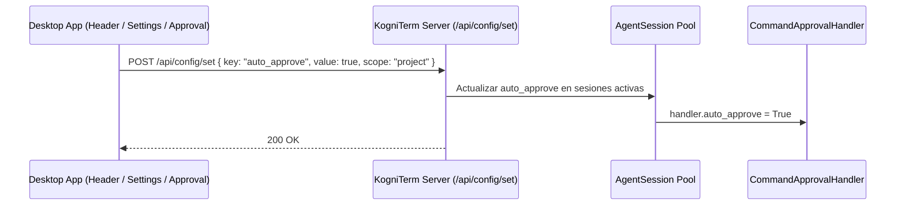

# Especificación de Diseño: Auto-aprobación de Comandos y Ediciones en KogniTerm Desktop

**Fecha**: 2026-08-06  
**Estado**: Aprobado por el usuario  

---

## 1. Visión General

Proporcionar al usuario del cliente desktop de KogniTerm una forma ágil e intuitiva de activar y desactivar la auto-aprobación de comandos de terminal y ediciones de archivos. El usuario podrá alternar este modo desde los Ajustes del Sistema (`SettingsModal`), desde un botón rápido en la cabecera del chat (`App.tsx`), o directamente desde la tarjeta de confirmación de aprobación (`CommandApproval.tsx`) mediante la opción "Aceptar siempre".

---

## 2. Arquitectura y Componentes Backend (`kogniterm`)

### 2.1. `ConfigManager` (`kogniterm/terminal/config_manager.py`)
- Admite la clave de configuración `auto_approve` (booleano, por defecto `False`).
- Soporta alcance Global (`~/.kogniterm/config.json`) y por Proyecto (`.kogniterm/config.json`).
- Si `auto_approve` está en `True`, las herramientas de edición y comandos de terminal no se pausarán solicitando interacción manual.

### 2.2. API REST (`kogniterm/server/app.py`)
- Al llamar a `POST /api/config/set` con `key: "auto_approve"`, el servidor actualizará la clave en `ConfigManager`.
- Además, notificará al `pool` de sesiones activas para actualizar dinámicamente `session.command_approval_handler.auto_approve` en todas las sesiones en ejecución.

### 2.3. `CommandApprovalHandler` y `AgentSession` (`kogniterm/terminal/command_approval_handler.py` & `session_pool.py`)
- Al crearse una `AgentSession`, se inicializa `command_approval_handler.auto_approve` consultando `ConfigManager().get_config("auto_approve")`.
- En `handle_command_approval`:
  - Si `auto_approve` es `True`, se evalúa la acción como autorizada automáticamente sin llamar a `ask_approval_sync` o emitir eventos WebSocket `approval_required`.

---

## 3. Componentes Frontend Desktop (`kogniterm-desktop/apps/desktop`)

### 3.1. Ajustes del Sistema (`SettingsModal.tsx`)
- En la pestaña **Ajustes Avanzados**, se añade una sección de automatización/seguridad:
  - Label: **Auto-aprobar Comandos y Ediciones**
  - Subtexto: *Ejecuta automáticamente modificaciones de archivos y comandos bash sin solicitar confirmación manual.*
  - Switch Toggle ligado a `getScopeValue('auto_approve', activeScope)`.

### 3.2. Interruptor Rápido en Cabecera (`App.tsx`)
- En la barra superior del cliente desktop (junto a los controles de estado y modelo):
  - Botón/Badge reactivo:
    - **ON**: Icono `Zap` (o `ShieldCheck`) en color esmeralda / verde con la etiqueta *"Auto-aprobación ON"*.
    - **OFF**: Icono `Shield` en color neutro / gris con la etiqueta *"Auto-aprobación OFF"*.
  - Al hacer clic, hace un `POST /api/config/set` para conmutar `auto_approve` y refresca el estado en la interfaz.

### 3.3. Botón "Aceptar siempre" en Confirmación (`CommandApproval.tsx`)
- Se añade un botón secundario **"Aceptar siempre"** (tecla rápida `A`).
- Al accionarlo:
  - Aprueba la solicitud actual pendiente (`onApprove(request.id)`).
  - Llama a la API `/api/config/set` para persistir `auto_approve: true`.

---

## 4. Flujo de Datos

---

## 5. Plan de Verificación

- **Backend**:
  - Verificar unitariamente que `CommandApprovalHandler.handle_command_approval` respete `auto_approve = True` sin requerir confirmación manual.
  - Verificar que `/api/config/set` actualice las sesiones en tiempo real.
- **Frontend**:
  - Probar que el toggle en `SettingsModal` cargue y guarde la propiedad `auto_approve`.
  - Probar que el botón rápido en la cabecera alterna el modo auto-aprobación inmediatamente.
  - Probar que el botón "Aceptar siempre" aprueba la solicitud y activa la auto-aprobación global/proyecto.
