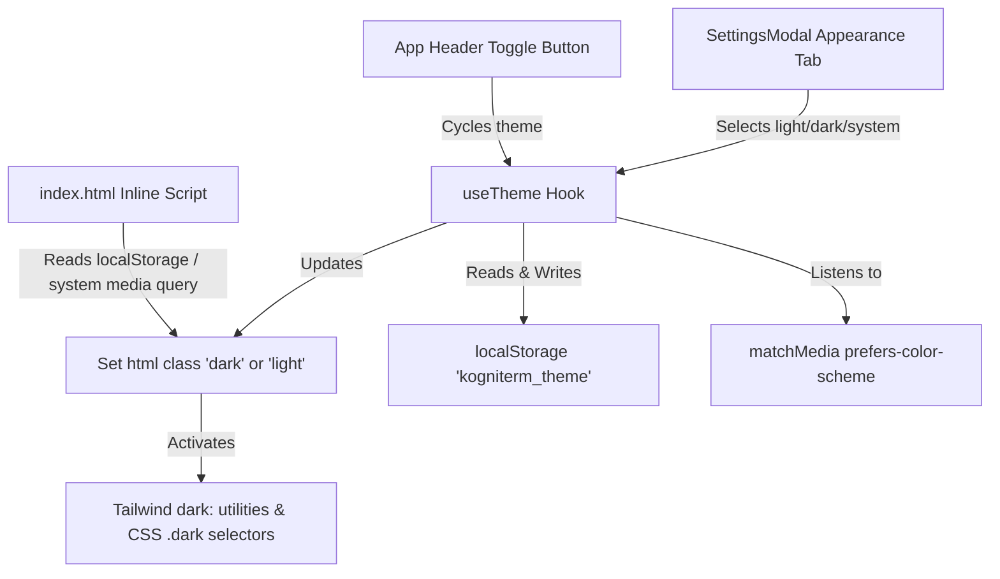

# KogniTerm Desktop - Dark Mode Design Specification

**Date**: 2026-08-14  
**Status**: Approved  
**Target Application**: `kogniterm-desktop/apps/desktop`

---

## 1. Overview & Goal

The goal of this feature is to add a full-featured, visually stunning Dark Mode to KogniTerm Desktop, supporting a 3-way theme selection:
1. **Light Mode** (☀️)
2. **Dark Mode** (🌙)
3. **System Preference** (💻)

The system ensures seamless theme switches across all components, markdown outputs, code blocks, chat bubbles, sidebars, and modals without page reload or visual flickering (FOUC).

---

## 2. Architecture & Data Flow

### Key Components

1. **Anti-FOUC Script (`index.html`)**:
   - Executes synchronously prior to React rendering.
   - Checks `localStorage.getItem('kogniterm_theme')`.
   - If set to `'dark'` or (`'system'` + system matches dark), adds class `dark` to `document.documentElement`.

2. **Custom Hook (`useTheme.ts`)**:
   - Location: `kogniterm-desktop/apps/desktop/src/hooks/useTheme.ts`
   - Exports `theme` (`'light' | 'dark' | 'system'`), `effectiveTheme` (`'light' | 'dark'`), and `setTheme(theme)`.
   - Updates `localStorage` and toggles `.dark` on `document.documentElement`.
   - Attaches a listener to `window.matchMedia('(prefers-color-scheme: dark)')` when `theme === 'system'`.

3. **Header Quick Toggle (`App.tsx`)**:
   - Quick toggle button in the top navigation header.
   - Cycle modes: `Light` -> `Dark` -> `System` -> `Light`.
   - Visual icon changes based on `theme` (Sun, Moon, Laptop/Monitor).

4. **Settings Modal (`SettingsModal.tsx`)**:
   - Add a new "Apariencia" (Appearance) tab in `SettingsModal.tsx`.
   - Radio/card selector allowing explicit choice between Light, Dark, and System.

5. **CSS & Styling System (`index.css`)**:
   - Define global variables for dark theme:
     - App background: `#09090b` (Zinc 950)
     - Sidebar background: `#0f0f12` (Zinc 900)
     - Cards & Panels: `#18181b` (Zinc 900) / `#27272a` (Zinc 800)
     - Borders: `rgba(255, 255, 255, 0.08)` / `border-zinc-800`
     - Body & Text: `#f4f4f5` (Zinc 100) / `#a1a1aa` (Zinc 400)
   - `.dark .markdown-content` styling overrides for dark mode:
     - Headings, text, links, lists, code cards, inline code (`#1e1e2e` background with vibrant syntax highlighting), blockquotes, and tables.
   - User chat bubbles, assistant messages, and thinking collapsible sections adapted for `.dark`.

---

## 3. UI Component Adaptations

| Component | Light Mode Style | Dark Mode Style (`.dark`) |
| :--- | :--- | :--- |
| **Main App Shell** | `#fafafa` | `#09090b` |
| **Left Sidebar** | `#f4f5f8` | `#0f0f12` |
| **Right Sidebar** | `#ffffff` | `#0f0f12` |
| **User Bubble** | `#f4f4f5` text `#18181b` | `#27272a` text `#f4f4f5` |
| **Markdown Text** | `#18181b` | `#e4e4e7` |
| **Inline Code** | `#f1f3fe` text `#4338ca` | `#27272a` text `#818cf8` |
| **Tool Badge** | `#f0fdf4` text `#166534` | `#064e3b` text `#6ee7b7` border `#047857` |
| **Modals** | `#ffffff` | `#18181b` |

---

## 4. Verification & Validation Plan

- Verify build (`npm run build` or `vite build`) in `kogniterm-desktop/apps/desktop`.
- Verify theme state persistence across page refresh in localStorage.
- Verify smooth transition without layout breaks or text contrast issues in both Light and Dark modes.
