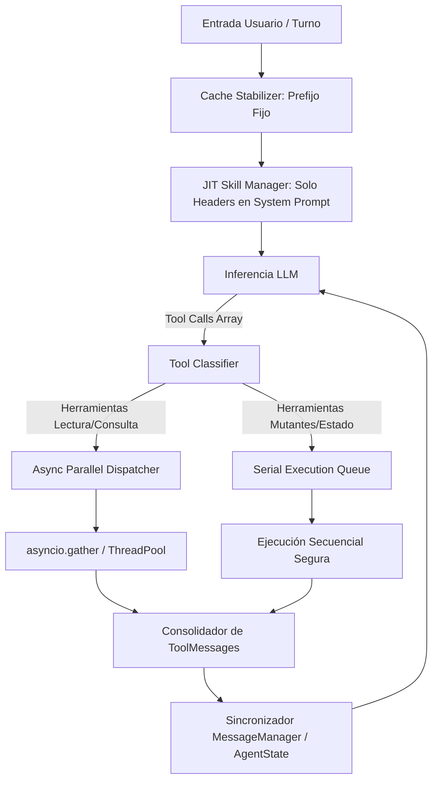

# Design Spec: Refactorización del Flujo del Agente (JIT Skills, Parallel Tools & Prompt Caching)

**Fecha:** 2026-08-18  
**Estado:** Aprobado por el usuario  
**Objetivo:** Reducir drásticamente la latencia y aumentar la velocidad de inferencia y ejecución de herramientas en KogniTerm manteniendo 100% compatibilidad con la especificación Agent Skills (`SKILL.md`) y el sistema dual de mensajes (`MessageManager`).

---

## 1. Problema y Diagnóstico

Actualmente, KogniTerm sufre cuellos de botella de latencia causados por:
1. **Sobrecarga de Tokens por Skills Estáticas**: Todo el contenido markdown de las skills instaladas se concatena e inyecta estáticamente en el System Prompt en cada turno de inferencia, elevando el conteo de tokens fijos y el Time To First Token (TTFT).
2. **Ejecución Secuencial de Herramientas**: Cuando el LLM emite múltiples llamadas a herramientas en un solo turno (ej. leer 4 archivos o buscar múltiples patrones), se ejecutan de forma bloqueante una por una en lugar de aprovechar la concurrencia asíncrona.
3. **Invalidación de Prompt Caching**: Cambios dinámicos impredecibles en las primeras posiciones del buffer de contexto impiden que las APIs de LLM (Gemini, Claude, OpenAI) aprovechen el almacenamiento en caché del prompt.

---

## 2. Arquitectura de la Solución

---

## 3. Componentes Principales

### 3.1. JIT Skill Manager (`kogniterm/core/skills/jit_skill_manager.py`)
- **Indexación Ligera al Inicio**: Lee únicamente la cabecera YAML frontmatter (`name`, `description`, `metadata`) de los archivos `SKILL.md`.
- **System Prompt Compacto**: Mantiene únicamente una lista estructurada de 1 línea por skill disponible.
- **Expansión JIT Bajo Demanda**: Cuando una skill se activa (vía trigger word o selección del LLM), se lee su cuerpo markdown completo e inyecta como un bloque de contexto temporal en ese turno específico.

### 3.2. Despachador de Herramientas Paralelas (`kogniterm/core/agents/parallel_tool_dispatcher.py`)
- **Clasificación por Naturaleza**:
  - **Read-Only / Side-Effect Free**: `read_file`, `grep_search`, `list_dir`, `web_search`, `get_file_info`.
  - **Mutantes / Estado**: `replace_file_content`, `write_to_file`, `run_command`, `delete_file`.
- **Ejecución Asíncrona Concurrente**: Las herramientas de lectura dentro de una misma respuesta del LLM se despachan concurrentemente utilizando `asyncio.gather()` y un pool de sub-hilos si realizan I/O bloqueante.
- **Preservación del Historial Dual**: Consolida los resultados en el orden exacto esperado por `MessageManager` para asegurar que las llamadas y respuestas de herramientas coincidan perfectamente en `history_for_api` y la UI.

### 3.3. Estabilizador de Prompt Caching (`kogniterm/core/context/cache_stabilizer.py`)
- **Estructuración por Capas del Contexto**:
  1. *Capa Fija (Head)*: Instrucciones del sistema + esquemas de herramientas estáticas (100% Cacheable).
  2. *Capa Dinámica (Tail)*: Inyección JIT de skills activas + historial reciente de la conversación.
- **Trimming Inteligente de Salidas**: Recorta o resume salidas masivas de herramientas antes de guardarlas en el contexto de la API, evitando desbordamientos de tokens.

---

## 4. Plan de Verificación

### Pruebas Automatizadas
- **`tests/test_jit_skill_manager.py`**: Verifica que solo los metadatos se carguen inicialmente y que el cuerpo de la skill se inyecte correctamente solo cuando se solicita.
- **`tests/test_parallel_tool_dispatcher.py`**: Verifica la ejecución paralela simultánea de 4 herramientas de lectura mockeadas y el ordenamiento correcto de resultados en `MessageManager`.
- **`tests/test_cache_stabilizer.py`**: Verifica que el prefijo del System Prompt se mantenga inmutable entre turnos de conversación.

### Verificación Manual & Benchmarking
- Medir la latencia de un turno con 5 lecturas de archivo secuenciales vs paralelas (esperado: reducción de 60-75% de tiempo).
- Medir el consumo de tokens inicial en el System Prompt (esperado: reducción de >50% de tokens de inicio).
