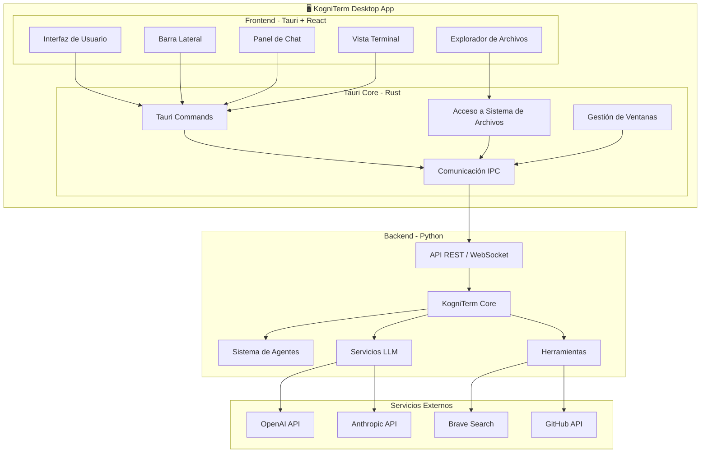
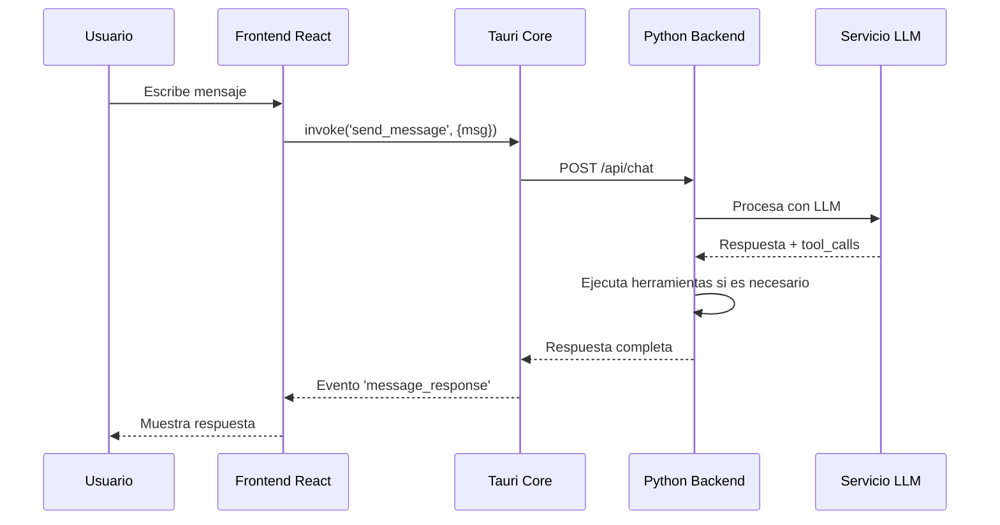

# 🚀 Propuesta: KogniTerm Desktop con Tauri

## Resumen Ejecutivo

Esta propuesta presenta una arquitectura para transformar KogniTerm en una aplicación desktop moderna utilizando **Tauri** como framework de frontend, manteniendo todas las funcionalidades existentes del sistema basado en Python.

### ¿Por qué Tauri?

| Característica | Beneficio para KogniTerm |
|----------------|-------------------------|
| **Tamaño reducido** | ~5MB vs 100MB+ de Electron |
| **Alto rendimiento** | Menor consumo de RAM/CPU |
| **Seguridad** | Control granular de permisos |
| **Multiplataforma** | Windows, macOS, Linux nativos |
| **WebView nativo** | Usa el motor del sistema operativo |

---

## 🏗️ Arquitectura Propuesta

### Arquitectura Híbrida: Frontend Tauri + Backend Python



### Flujo de Comunicación



---

## 📁 Estructura del Proyecto

```
kogniterm-desktop/
├── 📂 apps/
│   ├── 📂 desktop/                    # Aplicación Tauri
│   │   ├── 📂 src/
│   │   │   ├── 📂 components/         # Componentes React
│   │   │   │   ├── 📂 chat/           # Componentes del chat
│   │   │   │   ├── 📂 sidebar/        # Barra lateral
│   │   │   │   ├── 📂 terminal/       # Vista de terminal
│   │   │   │   ├── 📂 file-explorer/  # Explorador de archivos
│   │   │   │   └── 📂 common/         # Componentes compartidos
│   │   │   ├── 📂 hooks/              # Custom hooks
│   │   │   ├── 📂 stores/             # Estado global (Zustand)
│   │   │   ├── 📂 lib/                # Utilidades
│   │   │   ├── 📂 types/              # TypeScript types
│   │   │   ├── App.tsx
│   │   │   └── main.tsx
│   │   ├── 📂 src-tauri/              # Código Rust
│   │   │   ├── 📂 src/
│   │   │   │   ├── main.rs            # Punto de entrada
│   │   │   │   ├── commands.rs        # Comandos Tauri
│   │   │   │   ├── api_client.rs      # Cliente HTTP para Python
│   │   │   │   └── ipc.rs             # Comunicación IPC
│   │   │   ├── Cargo.toml
│   │   │   └── tauri.conf.json
│   │   ├── package.json
│   │   ├── tsconfig.json
│   │   ├── tailwind.config.js
│   │   └── vite.config.ts
│   │
│   └── 📂 server/                     # Servidor Python
│       ├── 📂 kogniterm_server/
│       │   ├── __init__.py
│       │   ├── main.py                # FastAPI/Flask entry
│       │   ├── 📂 api/
│       │   │   ├── routes.py          # Rutas REST
│       │   │   ├── websocket.py       # WebSocket handlers
│       │   │   └── models.py          # Pydantic models
│       │   ├── 📂 core/
│       │   │   └── adapter.py         # Adaptador de KogniTerm core
│       │   └── 📂 services/
│       │       ├── chat_service.py
│       │       ├── agent_service.py
│       │       └── file_service.py
│       ├── pyproject.toml
│       └── requirements.txt
│
├── 📂 packages/
│   ├── 📂 ui/                         # Componentes UI compartidos
│   │   ├── package.json
│   │   └── src/
│   │
│   └── 📂 types/                      # Tipos compartidos
│       ├── package.json
│       └── src/
│
├── 📂 docs/
│   ├── architecture.md
│   ├── api-reference.md
│   └── development-guide.md
│
├── turbo.json                         # Configuración monorepo
├── package.json
└── README.md
```

---

## 🛠️ Stack Tecnológico

### Frontend (Tauri + React)

| Tecnología | Propósito |
|------------|-----------|
| **Tauri** | Framework desktop multiplataforma |
| **React 18** | Biblioteca UI |
| **TypeScript** | Tipado estático |
| **Vite** | Build tool rápido |
| **Tailwind CSS** | Estilos utilitarios |
| **shadcn/ui** | Componentes UI accesibles |
| **Zustand** | Gestión de estado global |
| **TanStack Query** | Gestión de datos del servidor |
| **React Router** | Navegación SPA |
| **Monaco Editor** | Editor de código integrado |
| **XTerm.js** | Terminal embebida |

### Backend (Python)

| Tecnología | Propósito |
|------------|-----------|
| **FastAPI** | Framework API REST/WebSocket |
| **Uvicorn** | Servidor ASGI |
| **WebSockets** | Comunicación en tiempo real |
| **Pydantic** | Validación de datos |
| **KogniTerm Core** | Lógica de negocio existente |

### Comunicación

| Método | Uso |
|--------|-----|
| **HTTP REST** | Operaciones CRUD, configuración |
| **WebSocket** | Chat en tiempo real, streaming de respuestas |
| **Tauri Commands** | Acceso a sistema de archivos, notificaciones |

---

## 🎨 Diseño de Interfaz (UI/UX)

### Layout Principal (similar a OpenCode)

```
┌─────────────────────────────────────────────────────────────────┐
│  🧠 KogniTerm Desktop                              [_][□][X]     │
├──────────┬──────────────────────────────────────────────────────┤
│          │                                                      │
│  💬 Chat │  ┌────────────────────────────────────────────────┐  │
│  ─────── │  │  👤 Usuario: Crea un componente React...       │  │
│          │  │                                                  │  │
│  🔧 Tools│  │  🤖 KogniTerm: Claro, aquí tienes...            │  │
│  ─────── │  │  ```tsx                                          │  │
│          │  │  export function Button() {...}                  │  │
│  📁 Files│  │  ```                                             │  │
│  ─────── │  │                                                  │  │
│          │  └────────────────────────────────────────────────┘  │
│  ⚙️ Config│                                                      │
│          │  ┌────────────────────────────────────────────────┐  │
│          │  │  💭 Escribe un mensaje...          [Enviar]    │  │
│          │  └────────────────────────────────────────────────┘  │
│          │                                                      │
└──────────┴──────────────────────────────────────────────────────┘
```

### Componentes Principales

#### 1. Barra Lateral (Sidebar)

- **Navegación rápida** entre diferentes vistas
- **Historial de conversaciones**
- **Acceso a herramientas** (agentes, búsqueda, etc.)
- **Configuración** del usuario

#### 2. Panel de Chat Principal

- **Interfaz de chat** tipo conversación
- **Soporte Markdown** para respuestas formateadas
- **Bloques de código** con syntax highlighting
- **Streaming de respuestas** en tiempo real
- **Botones de acción** (copiar, ejecutar, guardar)

#### 3. Vista Terminal Integrada

- **Terminal embebida** con XTerm.js
- **Ejecución de comandos** del sistema
- **Visualización de salida** en tiempo real
- **Soporte para aprobación** de comandos peligrosos

#### 4. Explorador de Archivos

- **Árbol de archivos** del workspace
- **Operaciones básicas** (crear, renombrar, eliminar)
- **Vista previa** de archivos
- **Arrastrar y soltar** soporte

---

## 🔌 API y Comunicación

### Endpoints REST Principales

```typescript
// API Contract
interface KogniTermAPI {
  // Chat
  POST   /api/chat                    // Enviar mensaje
  GET    /api/chat/:id                // Obtener conversación
  DELETE /api/chat/:id                // Eliminar conversación
  
  // Agentes
  GET    /api/agents                  // Listar agentes disponibles
  POST   /api/agents/:id/invoke       // Invocar agente específico
  
  // Archivos
  GET    /api/files                   // Listar archivos
  GET    /api/files/:path             // Leer archivo
  POST   /api/files/:path             // Crear/actualizar archivo
  DELETE /api/files/:path             // Eliminar archivo
  
  // Configuración
  GET    /api/config                  // Obtener configuración
  PUT    /api/config                  // Actualizar configuración
  
  // Sesión
  GET    /api/session                 // Estado de sesión
  POST   /api/session/reset           // Reiniciar sesión
}
```

### WebSocket Events

```typescript
// WebSocket Events
interface WebSocketEvents {
  // Client -> Server
  'chat:message': { content: string; agent?: string }
  'chat:stream': { conversationId: string }
  
  // Server -> Client
  'message:chunk': { content: string; conversationId: string }
  'message:complete': { conversationId: string; metadata: any }
  'tool:execute': { tool: string; params: any }
  'tool:result': { result: any; error?: string }
}
```

---

## 📋 Plan de Implementación

### Fase 1: Fundamentos (Semanas 1-2)

- [ ] Configurar monorepo con Turbo
- [ ] Crear proyecto Tauri base
- [ ] Configurar servidor Python con FastAPI
- [ ] Establecer comunicación básica HTTP
- [ ] Setup de CI/CD básico

### Fase 2: Core Desktop (Semanas 3-5)

- [ ] Implementar layout principal con sidebar
- [ ] Desarrollar componente de chat básico
- [ ] Integrar WebSocket para streaming
- [ ] Adaptar KogniTerm core para API
- [ ] Sistema de temas claro/oscuro

### Fase 3: Funcionalidades Avanzadas (Semanas 6-8)

- [ ] Terminal embebida con XTerm.js
- [ ] Explorador de archivos
- [ ] Editor de código con Monaco
- [ ] Historial de conversaciones
- [ ] Gestión de múltiples workspaces

### Fase 4: Integración y Testing (Semanas 9-10)

- [ ] Integración completa con agentes KogniTerm
- [ ] Testing end-to-end
- [ ] Optimización de rendimiento
- [ ] Documentación de usuario
- [ ] Preparación para release

---

## 🚀 Ventajas de esta Arquitectura

### Escalabilidad

- **Separación de concerns**: Frontend y backend independientes
- **API REST/WebSocket**: Permite múltiples clientes en el futuro
- **Monorepo**: Facilita compartir código entre partes

### Mantenibilidad

- **TypeScript**: Tipado estático previene errores
- **Componentes reutilizables**: UI consistente
- **Documentación automática**: OpenAPI desde FastAPI

### Rendimiento

- **Tauri**: Binarios pequeños y rápidos
- **WebSocket**: Comunicación en tiempo real eficiente
- **Lazy loading**: Carga de componentes bajo demanda

### Seguridad

- **Tauri**: Permisos granulares por defecto
- **API segura**: Validación con Pydantic
- **Sin Chromium embebido**: Menor superficie de ataque

---

## 📊 Comparativa: Terminal vs Desktop

| Característica | Terminal Actual | Desktop Tauri |
|----------------|-----------------|---------------|
| Interfaz | CLI con Rich | GUI moderna |
| Tamaño | ~50MB Python | ~8MB total |
| Memoria | ~150MB | ~80MB |
| Experiencia | Terminal puro | IDE-like |
| Multiplataforma | Python deps | Binario nativo |
| Offline | ✅ | ✅ |
| Extensibilidad | Plugins Python | Plugins JS/Rust |

---

## 🎯 Próximos Pasos Recomendados

1. **Prototipo rápido**: Crear un MVP con chat básico (1 semana)
2. **Validación técnica**: Probar integración Tauri-Python
3. **Diseño detallado**: Mockups de UI/UX
4. **Plan de desarrollo**: Sprints detallados con milestones

---

## 📚 Recursos Adicionales

- [Tauri Documentation](https://tauri.app/)
- [FastAPI Documentation](https://fastapi.tiangolo.com/)
- [shadcn/ui Components](https://ui.shadcn.com/)
- [OpenCode Reference](https://github.com/opencode-ai/opencode)

---

**Fecha**: 2026-02-01  
**Versión**: 1.0  
**Autor**: KogniTerm Architecture Team
